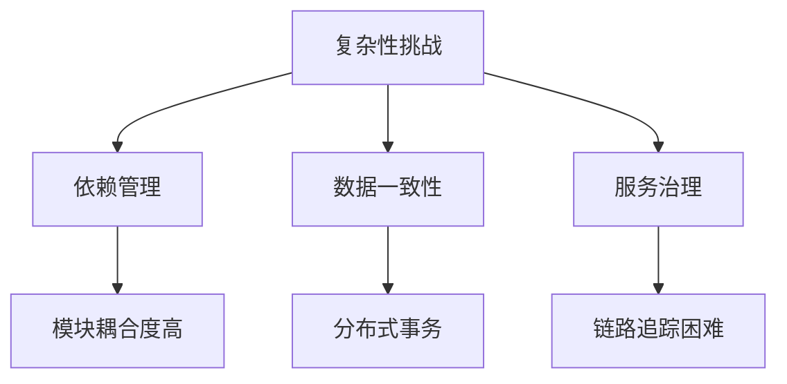

# Markdown 元素分类与解析指南

## Markdown 元素分类与解析指南

> 基于 [CommonMark Spec 0.29](https://spec.commonmark.org/0.29/) 和 [GitHub Flavored Markdown Spec](https://github.github.com/gfm/) 编写

### 1. Markdown 文档结构概述

Markdown 文档由一系列**块级元素**（blocks）组成，块级元素内部可以包含**内联元素**（inlines）。根据 CommonMark Spec 3.2 节的定义：

* **块级元素**（Block）：定义文档的结构，如段落、列表、引用等
* **内联元素**（Inline）：块级元素内部的格式化内容，如强调、链接、图片等

```plantuml
```

#### 文档解析的基本原则

**优先级规则**：块级元素的结构优先于内联元素的解析。块级元素可以包含内联元素，但内联元素不能包含块级元素。

### 2. Block Elements（块级元素）

块级元素分为两个基本类别：**容器块**（Container Blocks）和**叶子块**（Leaf Blocks）。

#### 2.1 Container Blocks（容器块）

**定义**（Spec 3.2）：容器块是可以包含其他块级元素作为内容的块。

**特性**：

* ✅ 可以嵌套其他块级元素（包括容器块自身）
* ✅ 形成文档的层次结构
* ✅ 支持递归嵌套，构建复杂的文档树
* ✅ 部分容器块支持**惰性延续**（lazy continuation）

**CommonMark 标准容器块**：

**2.1.1 Block Quote（块引用）**

* **语法**：每行以 `>` 开头（可选空格）
* **嵌套**：可以嵌套任意块级元素，包括其他块引用
* **惰性延续**：支持，延续行可以省略 `>` 标记
* **规范章节**：CommonMark 5.1

**2.1.2 List（列表）**

* **类型**：
  * **有序列表**：数字 + `.` 或 `)` 标记（如 `1.` `2)`）
  * **无序列表**：`-` `*` `+` 标记
* **模式**：
  * **Tight 模式**：列表项之间无空行，不生成 `<p>` 标签
  * **Loose 模式**：列表项之间有空行，生成 `<p>` 标签
* **嵌套**：可以嵌套任意块级元素
* **规范章节**：CommonMark 5.4

**2.1.3 List Item（列表项）**

* **定义**：列表的子元素，本身也是容器块
* **缩进规则**：延续内容需要与列表标记后的第一个非空白字符对齐
* **嵌套**：可以包含多个块级元素（段落、代码块、嵌套列表等）
* **规范章节**：CommonMark 5.2

**GFM 扩展容器块**：

**2.1.4 Task List Item（任务列表项）🔴 \[GFM]**

* **语法**：`- [ ]` 未完成，`- [x]` 或 `- [X]` 已完成
* **限制**：只能用于无序列表
* **规范章节**：GFM 5.3

#### 2.2 Leaf Blocks（叶子块）

**定义**（Spec 3.2）：叶子块是不包含其他块级元素的块，是块级结构的终端节点。

**特性**：

* ❌ 不可嵌套块级元素
* ✅ 大部分可以包含内联元素（在 Phase 2 解析）
* ⚠️ 部分叶子块不包含内联元素（如代码块、分隔线）

**CommonMark 标准叶子块**：

**2.2.1 Paragraph（段落）**

* **定义**：连续的非空行组成的文本块
* **结束条件**：空行或其他块级元素开始
* **内联内容**：✅ 包含内联元素
* **规范章节**：CommonMark 4.8

**2.2.2 ATX Heading（ATX 标题）**

* **语法**：1-6 个 `#` 开头，后接空格和标题文本
* **级别**：`#` 数量决定标题级别（1-6）
* **内联内容**：✅ 包含内联元素
* **规范章节**：CommonMark 4.2

**2.2.3 Setext Heading（Setext 标题）**

* **语法**：文本行 + 下一行的 `=`（一级）或 `-`（二级）
* **级别**：仅支持 1-2 级
* **限制**：需前置空行（某些情况）
* **内联内容**：✅ 包含内联元素
* **规范章节**：CommonMark 4.3

**2.2.4 Indented Code Block（缩进代码块）**

* **语法**：每行缩进 4 个空格或 1 个制表符
* **特性**：保留原始文本，不解析任何内容
* **内联内容**：❌ 不包含内联元素
* **规范章节**：CommonMark 4.4

**2.2.5 Fenced Code Block（围栏代码块）**

* **语法**：3 个以上 `` ` `` 或 `~` 包围
* **Info String**：可选的语言标识符和元数据
* **特性**：保留原始文本，不解析任何内容
* **内联内容**：❌ 不包含内联元素
* **规范章节**：CommonMark 4.5

**2.2.6 HTML Block（HTML 块）**

* **定义**：嵌入的 HTML 块级标签
* **类型**：6 种不同的 HTML 块类型（开始条件和结束条件不同）
* **内联内容**：✅ 可以包含内联元素（取决于具体类型）
* **规范章节**：CommonMark 4.6

**2.2.7 Link Reference Definition（链接引用定义）**

* **语法**：`[label]: url "optional title"`
* **作用**：为引用式链接提供目标 URL
* **特性**：不在最终输出中显示
* **内联内容**：❌ 不包含内联元素
* **规范章节**：CommonMark 4.7

**2.2.8 Thematic Break（分隔线）**

* **语法**：3 个以上 `*` `-` `_`（可选空格）
* **示例**：`---` `***` `___`
* **内联内容**：❌ 不包含内联元素
* **规范章节**：CommonMark 4.1

**2.2.9 Blank Line（空行）**

* **定义**：只包含空白字符的行
* **作用**：块级元素的分隔符
* **内联内容**：❌ 不包含内联元素
* **规范章节**：CommonMark 4.9

**GFM 扩展叶子块**：

**2.2.10 Table（表格）🔴 \[GFM]**

* **语法**：管道 `|` 分隔列，必须有标题行和分隔行
* **分隔行**：`---` 定义列，`:` 定义对齐方式
*   **示例**：

    ```
    | Header 1 | Header 2 |
    |----------|----------|
    | Cell 1   | Cell 2   |
    ```
* **内联内容**：✅ 单元格内可以包含内联元素
* **规范章节**：GFM 4.10

### 3. Inline Elements（内联元素）

**定义**（Spec 第 6 章）：内联元素是在块级元素内部的格式化内容。

**特性**：

* ✅ 只能存在于块级元素内部（不能独立存在）
* ❌ 不能包含块级元素
* ✅ 可以相互嵌套（遵循特定的优先级和嵌套规则）
* ⚙️ 使用**分隔符栈算法**（delimiter stack）解析

**CommonMark 标准内联元素**：

#### 3.1 文本格式化

**3.1.1 Emphasis（强调/斜体）**

* **语法**：`*text*` 或 `_text_`（单层分隔符）
* **嵌套规则**：可以嵌套，遵循左对齐原则
* **规范章节**：CommonMark 6.4

**3.1.2 Strong Emphasis（加粗/粗体）**

* **语法**：`**text**` 或 `__text__`（双层分隔符）
* **嵌套规则**：可以嵌套，可与 Emphasis 组合
* **规范章节**：CommonMark 6.4

**3.1.3 Code Span（行内代码）**

* **语法**：`` `code` ``（反引号包裹）
* **特性**：内部不解析任何 Markdown 语法
* **优先级**：高于链接解析
* **规范章节**：CommonMark 6.3

#### 3.2 链接与图片

**3.2.1 Link（链接）**

* **形式**：
  * **行内链接**：`[text](url "title")`
  * **引用链接**：`[text][label]` 或 `[text][]`
  * **自动链接**：`<url>`
* **嵌套限制**：链接内不能嵌套链接
* **规范章节**：CommonMark 6.6

**3.2.2 Image（图片）**

* **语法**：`![alt](url "title")`
* **差异**：与链接类似，但前面加 `!`
* **Alt 文本**：不解析为内联元素，作为纯文本
* **规范章节**：CommonMark 6.7

**3.2.3 Autolink（自动链接）**

* **语法**：`<URL>` 或 `<email@example.com>`
* **限制**：仅支持 URL 和 email
* **规范章节**：CommonMark 6.8

#### 3.3 换行与转义

**3.3.1 Hard Line Break（硬换行）**

* **语法**：
  * 行尾 2 个以上空格 + 换行
  * 反斜杠 `\` + 换行
* **效果**：生成 `<br>` 标签
* **规范章节**：CommonMark 6.12

**3.3.2 Soft Line Break（软换行）**

* **定义**：普通换行符
* **效果**：渲染为空格（不生成 `<br>`）
* **规范章节**：CommonMark 6.13

**3.3.3 Backslash Escape（反斜杠转义）**

* **语法**：`\` + ASCII 标点符号
* **作用**：转义特殊字符，显示为字面量
* **可转义字符**：`! " # $ % & ' ( ) * + , - . / : ; < = > ? @ [ \ ] ^ _` { | } \~\`
* **规范章节**：CommonMark 6.1

#### 3.4 HTML 与字符引用

**3.4.1 Raw HTML（原始 HTML）**

* **定义**：内联的 HTML 标签
* **类型**：开标签、闭标签、自闭合标签、注释、处理指令、声明、CDATA
* **规范章节**：CommonMark 6.10

**3.4.2 Entity and Numeric Character References（实体引用）**

* **语法**：
  * 命名实体：`&name;`（如 `&copy;` → ©）
  * 十进制引用：`&#N;`
  * 十六进制引用：`&#xN;` 或 `&#XN;`
* **规范章节**：CommonMark 6.2

**3.4.3 Textual Content（文本内容）**

* **定义**：普通字符文本
* **处理**：不是其他内联元素的字符
* **规范章节**：CommonMark 6.14

**GFM 扩展内联元素**：

#### 3.5 GFM 特有扩展

**3.5.1 Strikethrough（删除线）🔴 \[GFM]**

* **语法**：`~~text~~`（双波浪号）
* **渲染**：`<del>text</del>`
* **规范章节**：GFM 6.5

**3.5.2 Autolink (extended)（扩展自动链接）🔴 \[GFM]**

* **特性**：自动识别裸 URL（不需要尖括号）
* **支持**：`www.` 开头、完整 URL、email
* **规范章节**：GFM 6.9

**3.5.3 Disallowed Raw HTML（禁用的 HTML）🔴 \[GFM]**

* **过滤标签**：`<title>` `<textarea>` `<style>` `<xmp>` `<iframe>` `<noembed>` `<noframes>` `<script>` `<plaintext>`
* **安全目的**：防止 XSS 攻击
* **处理方式**：将 `<` 替换为 `&lt;`
* **规范章节**：GFM 6.11

### Markdown 元素分类规范（图形化 Spec）

````plantuml
@startjson
{
  "<size:14><b>Markdown Document</b></size>": {
    
    "<color:#2196F3><size:13><b>■ Block Element</b></size></color> 块级元素": {
      
      "<color:#1976D2><size:12><b>▸ Leaf Block</b></size></color> 叶子块": {
        "<color:#666><b>定义</b></color>": "不包含其他块级元素的原子块",
        "<color:#666><b>特性</b></color>": "❌ 不可嵌套块级元素  |  ✅ 可包含内联元素 (除*标记)",
        "<color:#666><b>包含关系</b></color>": "→ Inline Element (Phase 2解析)",
        "<color:#1976D2><b>可包含内联元素</b></color>": [
          "<color:#1565C0><b>Paragraph</b></color> 段落 - 连续文本块",
          "<color:#1565C0><b>ATX Heading</b></color> ATX标题 - #开头 1-6级",
          "<color:#1565C0><b>Setext Heading</b></color> Setext标题 - 下划线(=/-)标记 1-2级",
          "<color:#1565C0><b>HTML Block</b></color> HTML块 - 6种类型的HTML块",
          "<color:#FF6B6B><b>Table</b></color> <color:#FF6B6B>[GFM]</color> 表格 - 管道分隔 需标题行"
        ],
        "<color:#1976D2><b>不包含内联元素 *</b></color>": [
          "<color:#0D47A1><b>Indented Code Block</b></color> 缩进代码块 - 4空格缩进",
          "<color:#0D47A1><b>Fenced Code Block</b></color> 围栏代码块 - ```或~~~ 可选info string",
          "<color:#0D47A1><b>Link Reference Definition</b></color> 链接引用定义 - [label]: url",
          "<color:#0D47A1><b>Thematic Break</b></color> 分隔线 - 3+个 */- /_",
          "<color:#0D47A1><b>Blank Line</b></color> 空行 - 块分隔符"
        ]
      },
      
      "<color:#FF9800><size:12><b>▸ Container Block</b></size></color> 容器块": {
        "<color:#666><b>定义</b></color>": "可包含其他块级元素的容器",
        "<color:#666><b>特性</b></color>": "✅ 可嵌套块级元素  |  ✅ 递归嵌套  |  ✅ 形成文档树",
        "<color:#666><b>嵌套关系</b></color>": "→ Block Element (递归, 可包含自身)",
        "<color:#666><b>解析规则</b></color>": "支持惰性延续 (lazy continuation)",
        "<color:#FF9800><b>标准容器</b></color>": [
          "<color:#F57C00><b>Block Quote</b></color> 块引用 - > 前缀 可嵌套",
          "<color:#F57C00><b>List</b></color> 列表 - 有序(1.) 无序(-*+) tight/loose模式",
          "<color:#F57C00><b>List Item</b></color> 列表项 - 列表的子元素"
        ],
        "<color:#FF9800><b>GFM 扩展</b></color>": [
          "<color:#FF6B6B><b>Task List Item</b></color> <color:#FF6B6B>[GFM]</color> 任务列表 - [ ] 未完成 [x] 已完成"
        ]
      }
    },
    
    "<color:#4CAF50><size:13><b>■ Inline Element</b></size></color> 内联元素": {
      "<color:#666><b>定义</b></color>": "块级元素内部的行内格式化元素",
      "<color:#666><b>特性</b></color>": "✅ 只存在于块内  |  ❌ 不能包含块级元素  |  ✅ 可相互嵌套",
      "<color:#666><b>解析规则</b></color>": "Phase 2解析 | 分隔符栈算法 | 优先级规则",
      "<color:#4CAF50><b>文本格式</b></color>": [
        "<color:#388E3C><b>Emphasis</b></color> 强调/斜体 - *或_ 单层分隔符",
        "<color:#388E3C><b>Strong Emphasis</b></color> 加粗/粗体 - **或__ 双层分隔符",
        "<color:#388E3C><b>Code Span</b></color> 行内代码 - ` 反引号包裹 不解析内部",
        "<color:#FF6B6B><b>Strikethrough</b></color> <color:#FF6B6B>[GFM]</color> 删除线 - ~~ 双波浪号"
      ],
      "<color:#4CAF50><b>链接与图片</b></color>": [
        "<color:#2E7D32><b>Link</b></color> 链接 - 行内[]()/引用[][]/自动<> 三种形式",
        "<color:#2E7D32><b>Image</b></color> 图片 - ![alt](url) 类似链接 alt不解析",
        "<color:#2E7D32><b>Autolink</b></color> 自动链接 - <URL/email> 尖括号包裹",
        "<color:#FF6B6B><b>Autolink (extended)</b></color> <color:#FF6B6B>[GFM]</color> 扩展自动链接 - 裸URL识别"
      ],
      "<color:#4CAF50><b>换行与转义</b></color>": [
        "<color:#1B5E20><b>Hard Line Break</b></color> 硬换行 - 行尾2+空格 或 \\\\",
        "<color:#1B5E20><b>Soft Line Break</b></color> 软换行 - 普通换行 渲染为空格",
        "<color:#1B5E20><b>Backslash Escape</b></color> 反斜杠转义 - \\\\ 转义标点符号"
      ],
      "<color:#4CAF50><b>HTML与字符</b></color>": [
        "<color:#33691E><b>Raw HTML</b></color> 原始HTML - 行内HTML标签",
        "<color:#FF6B6B><b>Disallowed Raw HTML</b></color> <color:#FF6B6B>[GFM]</color> 禁用HTML - 过滤危险标签",
        "<color:#33691E><b>Entity References</b></color> 实体引用 - &name; &#N; &#xN;",
        "<color:#33691E><b>Textual Content</b></color> 文本内容 - 普通字符"
      ]
    },
    
    "<color:#9C27B0><b>⚙ 解析策略 (Parsing Strategy)</b></color>": {
      "<b>两阶段解析</b>": "Phase 1: 块结构 → Phase 2: 内联结构",
      "<b>Phase 1 块结构</b>": "逐行解析 | 匹配容器块 | 识别叶子块 | 构建块级树",
      "<b>Phase 2 内联结构</b>": "遍历叶子块 | 解析内联元素 | 分隔符栈 | 链接优先",
      "<b>优先级</b>": "容器块 > 叶子块 > 内联元素",
      "<b>分隔符栈算法</b>": "处理强调/链接 | 潜在开启/关闭符 | 匹配规则",
      "<b>惰性延续</b>": "段落/块引用支持 | 减少>标记 | 提高可读性"
    },
    
    "<color:#F44336><b>⚠ 关键规则 (Critical Rules)</b></color>": {
      "<b>不包含内联</b>": "Code Block | Thematic Break | Blank Line | Link Ref Def",
      "<b>嵌套限制</b>": "Link不能嵌套Link | Image的alt不解析内联",
      "<b>容器递归</b>": "Container可嵌套任意Block (包括自身)",
      "<b>列表模式</b>": "tight紧凑(无空行) | loose宽松(有空行) | 影响<p>标签",
      "<b>优先级冲突</b>": "Code Span优先于Link | 强调遵循左对齐规则",
      "<b>空白处理</b>": "行首空白(缩进) | 行尾空白(硬换行) | 不同含义",
      "<b>GFM安全</b>": "过滤脚本标签 | XSS防护 | 自动转义"
    },
    
    "<color:#607D8B><b>📊 元素统计</b></color>": {
      "Leaf Block": "CommonMark: 9种 | GFM扩展: +1 (Table)",
      "Container Block": "CommonMark: 3种 | GFM扩展: +1 (Task List Item)",
      "Inline Element": "CommonMark: 12种 | GFM扩展: +3 (Strikethrough/Autolink/HTML过滤)",
      "总计": "CommonMark: 24种 | GFM: 29种"
    }
  }
}
@endjson
````

**图例说明**：

* 🔵 **深蓝色系**：Leaf Block 及其元素（越深表示越特殊）
* 🟠 **橙色系**：Container Block 及其元素
* 🟢 **绿色系**：Inline Element 及其元素（按功能分组着色）
* 🔴 **红色 \[GFM]**：GitHub Flavored Markdown 扩展
* **\*** 标记：不包含内联元素的特殊叶子块

**参考规范**：

* [CommonMark Spec 0.29](https://spec.commonmark.org/0.29/) - 标准规范
* [GitHub Flavored Markdown Spec](https://github.github.com/gfm/) - GFM 扩展

**说明**：

* **实线箭头**：表示分类/继承关系
* **虚线箭头**：表示包含/嵌套关系（不影响主树结构）
* **颜色区分**：
  * 灰色：抽象概念
  * 蓝色：叶子块（不可嵌套块级元素）
  * 黄色：容器块（可嵌套块级元素）
  * 绿色：内联元素
* **特殊规则**：Code Block 和 Thematic Break 不包含内联元素

### 4. 解析策略（Parsing Strategy）

根据 CommonMark Spec 附录"A parsing strategy"，Markdown 解析采用**两阶段解析**策略。

#### 4.1 概述（Overview）

Markdown 解析分为两个独立的阶段：

1. **Phase 1**：解析块级结构（block structure）
2. **Phase 2**：解析内联结构（inline structure）

这种分离使得解析过程更加清晰和高效。

#### 4.2 Phase 1: 块结构解析（Block Structure）

**目标**：逐行处理输入，构建块级元素树。

**算法流程**：

1. **初始化**：创建文档（document）节点作为根节点
2. **逐行处理**：
   * 检查当前打开的块是否可以继续（通过检查块标记）
   * 关闭不再匹配的块
   * 打开新的块（容器块或叶子块）
   * 将文本内容添加到最后一个打开的叶子块
3. **特殊处理**：
   * **Setext 标题**：段落关闭时检测下划线是否为 Setext 标题
   * **链接引用定义**：段落关闭时解析是否为链接引用定义
   * **惰性延续**：某些块（段落、块引用）支持不带标记的延续行

**匹配容器块的规则**：

* 从文档根开始，逐层匹配已打开的容器块
* 如果当前行与容器块标记匹配，则"消费"该标记并进入子块
* 如果不匹配，则关闭该容器块

**打开新块的规则**：

* 在消费完所有容器块标记后，检查剩余内容
* 根据剩余内容的特征识别新块的类型
* 优先级：容器块 > 叶子块

**示例**（Spec 附录示例）：

输入：

```




> Lorem ipsum dolor
sit amet.
> - Qui *quodsi iracundia*
> - aliquando id
```

解析过程：

1. 第一行：创建 `block_quote` → 创建 `paragraph` → 添加文本
2. 第二行：惰性延续，追加到 `paragraph`
3. 第三行：关闭 `paragraph` → 创建 `list` → 创建 `list_item` → 创建 `paragraph` → 添加文本
4. 第四行：关闭前一个 `list_item` → 创建新 `list_item` → 创建 `paragraph` → 添加文本

最终树结构：

```
document
└── block_quote
    ├── paragraph
    │   └── "Lorem ipsum dolor\nsit amet."
    └── list (bullet)
        ├── list_item
        │   └── paragraph
        │       └── "Qui *quodsi iracundia*"
        └── list_item
            └── paragraph
                └── "aliquando id"
```

#### 4.3 Phase 2: 内联结构解析（Inline Structure）

**目标**：遍历所有叶子块，解析其内部的内联元素。

**时机**：Phase 1 完成后，所有块已关闭，所有链接引用定义已收集。

**算法流程**：

1. **遍历树**：访问每个叶子块节点
2. **解析内联元素**：
   * 解析段落（paragraph）和标题（heading）的文本内容
   * 使用**分隔符栈算法**处理强调和链接
   * 解析其他内联元素（代码、HTML 等）
3. **解析链接**：此时所有链接引用定义已可用，可以解析引用式链接

**示例**（续前例）：

内联解析后：

```
document
└── block_quote
    ├── paragraph
    │   ├── str "Lorem ipsum dolor"
    │   ├── softbreak
    │   └── str "sit amet."
    └── list (bullet)
        ├── list_item
        │   └── paragraph
        │       ├── str "Qui "
        │       └── emph
        │           └── str "quodsi iracundia"
        └── list_item
            └── paragraph
                └── str "aliquando id"
```

注意：

* 换行符被解析为 `softbreak`
* `*quodsi iracundia*` 被解析为 `emph` 节点

#### 4.4 分隔符栈算法（Delimiter Stack Algorithm）

**用途**：解析强调（emphasis）、加粗（strong emphasis）、链接（link）和图片（image）。

**核心思想**：使用双向链表（delimiter stack）存储潜在的开启/关闭分隔符。

**算法步骤**：

1. **遇到 `*`** **`_`** **`[`** **`![`**：
   * 创建文本节点
   * 将指针压入分隔符栈
   * 标记为潜在开启符、潜在关闭符或两者
2. **遇到 `]`**：
   * 调用 **look for link or image** 过程
   * 回溯栈寻找匹配的 `[` 或 `![`
   * 如果找到匹配，解析链接/图片
   * 如果是链接，将之前的所有 `[` 标记为非活跃（防止链接嵌套）
3. **遇到输入结束或 `]`**：
   * 调用 **process emphasis** 过程
   * 处理强调和加粗
   * 匹配成对的 `*` 或 `_`
   * 根据长度决定是 emphasis 还是 strong emphasis

**关键规则**：

* **潜在开启符/关闭符的判断**：基于分隔符前后的字符（空白、标点等）
* **左对齐规则**：优先匹配最接近输入开始的分隔符
* **嵌套规则**：
  * `*` 和 `_` 可以嵌套
  * 链接不能嵌套链接
  * Code span 优先于链接（已解析的 code span 内的 `[` 不进入栈）

#### 4.5 优先级规则（Precedence）

根据 Spec 3.1 节，当不同的块级结构或内联结构发生冲突时，遵循以下优先级：

**块级优先级**（从高到低）：

1. 容器块标记（`>` 块引用、列表标记）
2. 缩进代码块（4 空格缩进）
3. 围栏代码块（` ``` ` 或 `~~~`）
4. ATX 标题（`#` 开头）
5. Setext 标题下划线（`=` 或 `-`）
6. 分隔线（`---` `***` `___`）
7. HTML 块
8. 链接引用定义
9. 段落（默认）

**内联优先级**（从高到低）：

1. Code span（`` ` ``）- 优先级最高，内部不解析其他元素
2. HTML 标签（`<tag>`）
3. Autolink（`<url>`）
4. Link（`[text](url)` 或 `[text][ref]`）
5. Image（``）
6. Emphasis 和 Strong（`*` `_`）

**中断规则**：某些块级元素可以中断段落（不需要前置空行）：

* ATX 标题
* 围栏代码块
* 分隔线
* 列表（某些条件下）

### 5. 关键规则汇总

#### 5.1 包含与嵌套规则

| 元素类型                | 可包含块级元素 | 可包含内联元素 | 特殊限制           |
| ------------------- | ------- | ------- | -------------- |
| **Container Block** | ✅ 可递归嵌套 | -       | 可嵌套任意块（包括自身）   |
| **Leaf Block（大部分）** | ❌ 不可嵌套  | ✅ 可包含   | 在 Phase 2 解析内联 |
| **Code Block**      | ❌ 不可嵌套  | ❌ 不包含   | 保留原始文本         |
| **Thematic Break**  | ❌ 不可嵌套  | ❌ 不包含   | 纯视觉分隔符         |
| **Link Ref Def**    | ❌ 不可嵌套  | ❌ 不包含   | 不在输出中显示        |
| **Blank Line**      | ❌ 不可嵌套  | ❌ 不包含   | 块分隔符           |
| **Inline Element**  | ❌ 不能包含  | ✅ 可嵌套   | Link 不嵌套 Link  |

#### 5.2 列表规则（List Rules）

**Tight vs Loose 模式**：

* **Tight**：列表项之间无空行，列表项内容不包裹 `<p>` 标签
* **Loose**：列表项之间有空行，或列表项包含多个块，内容包裹 `<p>` 标签

**列表缩进**：

* 列表内容的延续行需与列表标记后第一个非空白字符对齐
* 嵌套列表需额外缩进

**列表中断**：

* 有序列表和无序列表不能相互中断（需要空行分隔）
* 序号为 1 的有序列表可以中断段落

#### 5.3 惰性延续（Lazy Continuation）

**支持惰性延续的块**：

* Paragraph（段落）
* Block Quote（块引用）

**定义**：延续行可以省略块标记。

**示例**：

```markdown
> This is a block quote
continuing on the next line
```

等价于：

```markdown
> This is a block quote
> continuing on the next line
```

**不支持惰性延续的块**：

* List Item（列表项必须保持缩进）
* Code Block（必须保持缩进或围栏）

#### 5.4 特殊字符处理

**空白字符**：

* **行首空白**：决定缩进，影响块级结构
* **行尾空白**：2+ 空格表示硬换行
* **Tab 字符**：等价于 4 个空格（但有特殊展开规则）

**转义字符**：

* `\` 可转义 ASCII 标点符号
* 在代码块和 code span 中，`\` 不起转义作用

#### 5.5 GFM 安全特性

**禁用的 HTML 标签**（GFM 6.11）：

* 过滤脚本相关标签：`<script>` `<iframe>` 等
* 防止 XSS 攻击
* 将 `<` 替换为 `&lt;`

**表格限制**（GFM 4.10）：

* 必须有标题行和分隔行
* 分隔行至少 3 个 `-`
* 单元格内可以包含内联元素，但不能包含块级元素

### 6. 实现建议

#### 6.1 解析器架构

基于 Spec 的两阶段解析策略，推荐的解析器架构：

```
输入文本
   ↓
Phase 1: 块结构解析器
   ├─ 行处理器（Line Processor）
   ├─ 容器块匹配器（Container Matcher）
   ├─ 叶子块识别器（Leaf Detector）
   └─ 块级树构建器（Block Tree Builder）
   ↓
块级 AST（Abstract Syntax Tree）
   ↓
Phase 2: 内联结构解析器
   ├─ 文本扫描器（Text Scanner）
   ├─ 分隔符栈（Delimiter Stack）
   ├─ 链接解析器（Link Parser）
   └─ 内联元素构建器（Inline Builder）
   ↓
完整 AST
   ↓
渲染器（Renderer）
   ↓
HTML/其他格式输出
```

#### 6.2 关键数据结构

**块级节点**：

```javascript
{
  type: 'paragraph' | 'heading' | 'list' | ...,
  children: [...],      // 子块（容器块）或内联节点（叶子块）
  attrs: {              // 块特有属性
    level: 1-6,         // 标题级别
    ordered: true,      // 列表类型
    tight: true,        // 列表模式
    ...
  },
  sourcepos: [start, end]  // 源码位置
}
```

**内联节点**：

```javascript
{
  type: 'text' | 'emph' | 'link' | ...,
  content: '...',       // 文本内容
  children: [...],      // 嵌套的内联节点
  attrs: {              // 元素特有属性
    destination: '...',  // 链接目标
    title: '...',        // 链接标题
    ...
  }
}
```

**分隔符栈项**：

```javascript
{
  type: '*' | '_' | '[' | '![',
  count: 1-N,           // 分隔符数量
  node: textNode,       // 指向文本节点的指针
  canOpen: true,        // 是否可作为开启符
  canClose: true,       // 是否可作为关闭符
  active: true          // 是否活跃
}
```

#### 6.3 测试建议

**使用官方测试套件**：

* CommonMark 提供了 600+ 个官方测试用例
* 下载地址：https://spec.commonmark.org/0.29/spec.json
* GFM 扩展也有对应的测试用例

**关键测试场景**：

1. **边界情况**：空文档、单字符、极长行
2. **嵌套场景**：多层列表、列表中的代码块、引用中的列表
3. **惰性延续**：块引用的惰性延续
4. **优先级冲突**：同时满足多种块级元素开始条件
5. **Unicode 处理**：非 ASCII 字符、emoji、RTL 文本
6. **安全测试**（GFM）：HTML 注入、XSS 防护

#### 6.4 性能优化

**Phase 1 优化**：

* 增量解析：只重新解析修改的行及受影响的块
* 容器块缓存：缓存容器块的匹配结果
* 提前终止：某些情况下可提前判断块类型

**Phase 2 优化**：

* 批量处理：一次遍历处理多种内联元素
* 分隔符栈剪枝：及时移除无法匹配的分隔符
* 字符串优化：减少字符串复制，使用字符串切片

**通用优化**：

* 避免正则表达式回溯：使用线性复杂度的匹配算法
* 内存池：重用节点对象，减少 GC 压力
* 流式处理：支持大文件的流式解析

### 7. 元素速查表

#### 7.1 块级元素速查

| 元素                 | 语法                | 示例                         | 包含内联 | GFM |
| ------------------ | ----------------- | -------------------------- | ---- | --- |
| **Paragraph**      | 连续非空行             | `This is a paragraph.`     | ✅    | -   |
| **ATX Heading**    | `#` 开头            | `## Heading 2`             | ✅    | -   |
| **Setext Heading** | 下划线               | `Heading\n=======`         | ✅    | -   |
| **Indented Code**  | 4 空格缩进            | `code`                     | ❌    | -   |
| **Fenced Code**    | ` ``` ` 或 `~~~`   | ` ```js\ncode\n``` `       | ❌    | -   |
| **HTML Block**     | HTML 标签           | `<div>...</div>`           | 视类型  | -   |
| **Link Ref Def**   | `[label]: url`    | `[1]: https://example.com` | ❌    | -   |
| **Thematic Break** | `---` `***` `___` | `---`                      | ❌    | -   |
| **Blank Line**     | 空行                |                            | ❌    | -   |
| **Table**          | 管道分隔              | `\| A \| B \|`             | ✅    | 🔴  |
| **Block Quote**    | `>` 开头            | `> quote`                  | 容器   | -   |
| **List**           | `-` `*` `+` `1.`  | `- item`                   | 容器   | -   |
| **List Item**      | 列表子元素             | 见 List                     | 容器   | -   |
| **Task List Item** | `- [ ]` `- [x]`   | `- [x] Done`               | 容器   | 🔴  |

#### 7.2 内联元素速查

| 元素                 | 语法           | 示例                      | GFM |
| ------------------ | ------------ | ----------------------- | --- |
| **Emphasis**       | `*` 或 `_`    | `*italic*`              | -   |
| **Strong**         | `**` 或 `__`  | `**bold**`              | -   |
| **Code Span**      | `` ` ``      | `` `code` ``            | -   |
| **Link**           | `[](url)`    | `[text](url)`           | -   |
| **Image**          | ``   | ``           | -   |
| **Autolink**       | `<url>`      | `<https://example.com>` | -   |
| **Hard Break**     | 2+ 空格 或 `\\` | `line1 \nline2`         | -   |
| **Soft Break**     | 普通换行         | `line1\nline2`          | -   |
| **Escape**         | `\`          | `\*not italic\*`        | -   |
| **Entity**         | `&name;`     | `&copy;` → ©            | -   |
| **Raw HTML**       | `<tag>`      | `<span>text</span>`     | -   |
| **Text**           | 普通字符         | `plain text`            | -   |
| **Strikethrough**  | `~~`         | `~~deleted~~`           | 🔴  |
| **Autolink (ext)** | 裸 URL        | `https://example.com`   | 🔴  |

### 8. 常见误区与注意事项

#### 8.1 常见误区

❌ **误区 1**：认为所有叶子块都包含内联元素

* ✅ **正确**：代码块、分隔线、空行、链接引用定义不包含内联元素

❌ **误区 2**：认为链接可以嵌套链接

* ✅ **正确**：链接内不能嵌套链接（Spec 规定）

❌ **误区 3**：认为强调使用 `*` 和 `_` 完全等价

* ✅ **正确**：在某些上下文中有细微差异（词内强调规则不同）

❌ **误区 4**：认为 GFM 表格的单元格可以包含块级元素

* ✅ **正确**：表格单元格只能包含内联元素

❌ **误区 5**：认为缩进总是 4 个空格

* ✅ **正确**：Tab 字符有特殊展开规则（tab stops）

#### 8.2 边界情况处理

**空输入**：

* 空文档应生成空的文档节点
* 只包含空白的文档应生成空的文档节点

**嵌套深度**：

* 理论上容器块可以无限嵌套
* 实践中建议限制嵌套深度（防止栈溢出）

**Unicode 字符**：

* Spec 基于 Unicode 字符处理
* 需正确识别 Unicode 空白字符和标点符号
* emoji 等符号需特殊处理

**行结束符**：

* 支持 `\n` `\r\n` `\r` 三种行结束符
* 统一规范化为 `\n`

#### 8.3 兼容性注意

**CommonMark vs GFM**：

* GFM 是 CommonMark 的**严格超集**
* 所有 CommonMark 合法的文档在 GFM 中也合法
* GFM 新增了表格、任务列表、删除线、扩展自动链接

**不同 Markdown 方言**：

* **Markdown.pl**（原始实现）：很多未定义行为
* **MultiMarkdown**：添加了脚注、表格等扩展
* **Pandoc Markdown**：功能最丰富，支持学术写作
* **kramdown**：Ruby 社区常用，支持属性列表

**向后兼容**：

* 如需支持旧 Markdown 文档，考虑宽松模式
* 文档迁移时注意测试边界情况

### 9. 参考资料

#### 官方规范

* [**CommonMark Spec 0.29**](https://spec.commonmark.org/0.29/)\
  CommonMark 官方规范，定义了标准 Markdown 语法
* [**GitHub Flavored Markdown Spec**](https://github.github.com/gfm/)\
  GitHub 官方的 Markdown 规范，基于 CommonMark 扩展

#### 测试套件

* [**CommonMark Test Suite**](https://spec.commonmark.org/0.29/spec.json)\
  600+ 官方测试用例（JSON 格式）
* [**GFM Test Suite**](https://github.com/github/cmark-gfm/tree/master/test)\
  GFM 扩展的测试用例

#### 参考实现

* [**cmark**](https://github.com/commonmark/cmark)\
  CommonMark 官方 C 实现（参考实现）
* [**cmark-gfm**](https://github.com/github/cmark-gfm)\
  GitHub 的 GFM 实现（基于 cmark）
* [**markdown-it**](https://github.com/markdown-it/markdown-it)\
  流行的 JavaScript 实现，支持插件
* [**commonmark.js**](https://github.com/commonmark/commonmark.js)\
  官方 JavaScript 实现

#### 相关资源

* [**Markdown Guide**](https://www.markdownguide.org/)\
  Markdown 学习指南
* [**Dingus (在线测试)**](https://spec.commonmark.org/dingus/)\
  CommonMark 在线测试工具
* [**Babelmark (对比工具)**](https://babelmark.github.io/)\
  对比不同 Markdown 实现的渲染结果

***

**文档版本**：v1.0\
**基于规范**：CommonMark Spec 0.29 + GitHub Flavored Markdown Spec (2019-04-06)\
**最后更新**：2025-12-02
