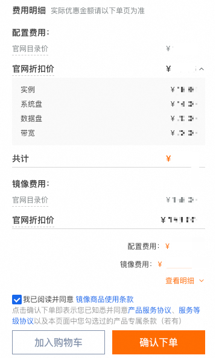

# 包年包月计费方式详解-云服务器 ECS-阿里云

包年包月是一种预付费的计费方式，您需要预先支付一段时间（如1月、1年）的费用，以获得更低的单价和更大的成本节约，购买时长越长，折扣越大。本文主要介绍包年包月ECS资源的适用场景、到期后影响、退款说明等信息。

### 适用场景

当您的业务具有如下特征时，推荐购买包年包月资源：

* 可预估资源使用周期。
* 具有较稳定的业务场景。
* 需要长期使用资源。

常见场景：例如 7×24 小时的官网页面服务、数据库服务等。

### 计费规则

包年包月为预付费模式，包含实例规格、系统盘、数据盘、镜像及固定带宽公网流量的基础资源费用。若实例购买时配置的资源全部为包年包月计费方式，则购买周期内无额外扣费，到期自动停机。若中途调整实例配置，升级需补差价，降级可依据退款规则退还差额。

说明：

* 购买包年包月实例时，可能会因为配置了按量付费资源或功能在实例使用时产生额外费用。如果您要保持多种计费方式，请关注您的账户余额，以免余额不足欠费影响资源使用。您也可以查看 [计费FAQ](/broken/pages/8c248e032e2728fb594c29ef1e95034943262576#4b47f5a4c9ixw) 了解包年包月情况下的按量付费费用产生情况。如果您想将此类按量付费资源转为包年包月计费，请参见 [转换计费方式](/broken/pages/246b2887af13c9847d3c3a70f97b879eb3d8210f)。
* 阿里云的包年包月服务中的购买、续费时长均指自然年、月。比如您在 2025 年 2 月某日购买了 1 个月的 ECS 云服务器，到期日为 2025 年 3 月同日，而非 30 天后。

#### 基础计费项

假设您计划以包年包月的计费方式购买一台使用付费镜像的 ECS 云服务器，并同时购买一块数据盘，分配了公网 IPv4 地址并选择按固定带宽计费。在购买云服务器页面右下角，单击查看明细，您将看到所需费用的明细，如下图所示。

|                                          |                                                                                                                                                                                                                                                                                                                                                                                                                                                                                                                    |
| ---------------------------------------- | ------------------------------------------------------------------------------------------------------------------------------------------------------------------------------------------------------------------------------------------------------------------------------------------------------------------------------------------------------------------------------------------------------------------------------------------------------------------------------------------------------------------ |
|  | 
按照假设情况购买的实例的费用明细将包括以下部分： - <strong>实例</strong>：即 <strong>实例规格</strong> 费用。实例规格费用是您在购买指定规格实例时，所需支付的基础费用，具体包括该实例规格下的计算资源（vCPU、内存、GPU）费用、不可卸载的存储设备（本地盘）费用，以及功能增强组件费用，不包括付费镜像、块存储（系统盘、数据盘）、公网带宽、快照等使用费用。  - <strong>系统盘：云盘</strong> 容量费用。  - <strong>数据盘：云盘</strong> 容量费用。  - <strong>带宽：公网带宽（按固定带宽）</strong> 费用，根据所选带宽大小计算的费用。  - <strong>镜像费用：镜像</strong> 许可证费用，基于付费镜像的市场价格。  您可以根据您购买时的计费明细中显示的计费项对照查看对应计费项的计费规则。 <strong>说明</strong> 本场景仅作计费项和计费规则说明示例，实际计费项请以您购买时显示为准。
 |

包年包月的实例购买价格取决于您所购买实例的地域、资源规格及购买时长，具体规则见下表。

| 计费项                                                                                 |                                                                                            包年包月价格 | 购买时长                                                                                                                                                                                               |
| ----------------------------------------------------------------------------------- | ------------------------------------------------------------------------------------------------: | -------------------------------------------------------------------------------------------------------------------------------------------------------------------------------------------------- |
| [实例规格](/broken/pages/e9f47c18f67fdeb42f0458db5f2958c07ba54f3e)                      |                    同一实例规格在不同地域下的价格可能不同，具体价格请参见[云服务器ECS定价页](https://www.aliyun.com/price/product)。 | 
1周至5年，具体可购买时长请参见下单购买页面。 说明：如果您的实例用于 Web 服务，中国内地必须完成ICP备案，备案实例（含续费）时长需在3个月及以上，详细规则请参见 <a href="https://help.aliyun.com/zh/icp-filing/basic-icp-service/user-guide/overview">ICP备案前准备</a>。
 |
| [云盘](/broken/pages/1f0798a3a257f5c2ab2c04ed33b8815087bc57cf)                        |           同一类型的云盘在不同地域的价格均可能不同，具体价格请参见[块存储价格](https://www.aliyun.com/price/product#/disk/detail)。 | 包年包月实例中的此部分资源仅可随实例一起下单购买，费用计算时购买时长与实例购买时长相同。                                                                                                                                                       |
| [公网带宽（按固定带宽）](/broken/pages/3bc24106bebc69cf9c8609e0ea0fa883e9c03e3c#5103cc3d2dkh7) |              不同地域的公网带宽价格请参见[云服务器ECS定价](https://www.aliyun.com/price/product#/ecs/detail)中的带宽价格页签。 | —                                                                                                                                                                                                  |
| [镜像](/broken/pages/2a695847d8765387eac28ced7180e7ce0bb1e172)                        | 阿里云公共镜像单价请参见 [镜像计费](/broken/pages/2a695847d8765387eac28ced7180e7ce0bb1e172)，云市场镜像价格以创建实例时显示的信息为准。 | —                                                                                                                                                                                                  |

#### 升级与降配

创建实例后，如果当前实例配置无法满足您的业务需求，您可以修改实例规格、公网带宽配置和数据盘配置，操作和详细介绍请参见 [升降配方式概述](/broken/pages/fbb5594fbaf2fae37acb7523f7bf6f3f7d0bb193)。实例在升降配后会涉及以下费用变动：

* 升级配置：升级配置时需补缴新配置费用与剩余价值的差额，具体费用以升级时页面上显示的费用信息为准。
* 降低配置：实例进行降配操作后会发生降配退款，退款金额的计算方式请参见 [资源降配退款](https://help.aliyun.com/zh/user-center/cancel-subscription/#12a66a5a513qd)。

### 转换计费方式

#### 包年包月转按量付费

创建一台包年包月 ECS 实例后，您可以将 ECS 实例的计费方式转为按量付费，回收部分成本，同时更加灵活地按需使用 ECS 实例。包年包月 ECS 实例转换为按量付费 ECS 实例后，请确保支付方式可用额度充足以免发生欠费，影响 ECS 实例正常运行。具体操作和变更影响，请参见 [包年包月转按量付费](/broken/pages/d33d7e0df50301c2e3a38f0a5ed3ad4b7e411a24)。

#### 按量付费转包年包月

将按量付费的实例转为包年包月，可以提前预留资源，同时享受更大的价格优惠。具体操作和变更影响，请参见 [按量付费转包年包月](/broken/pages/256f4fbac376dc1042ea84198c0a74131e005767#PAYGtoSubs-china)。

### 到期及续费说明

在 ECS 包年包月资源到期前，建议您尽快 [续费实例](/broken/pages/e281b1d39680469ac2173d040ca9db0008188575)，或通过快照保存数据，避免造成数据和业务损失。若有其他问题，您可以参见 [资源续订常见问题](https://help.aliyun.com/zh/user-center/support/renewal-guide-q-a)。

#### 到期提醒

阿里云消息中心提供了续费提醒功能，默认会在实例到期前 7 天、3 天、1 天、到期当天及释放前一天通过站内信、邮箱、短信提醒您及时续费。您也可以在消息中心主动订阅实例到期前 15 或 30 天的提醒，或修改提醒接收手机号。具体操作，请参见 [设置续费提醒](/broken/pages/2a33243fa9f356a54a82343118ac00e64659fcf8)。

#### 到期后影响

| 资源类型   | 到期后15天内（已过期）                           | 到期后15天内（过期回收中）                           | 到期第16天0点起                                                                                                                                                                                                                   |
| ------ | -------------------------------------- | ---------------------------------------- | --------------------------------------------------------------------------------------------------------------------------------------------------------------------------------------------------------------------------- |
| 实例规格资源 | 保留计算资源（vCPU、GPU和内存等）。保留本地盘和本地盘数据。      | 在此期间释放计算资源（vCPU、GPU和内存等）。保留本地盘，但释放本地盘数据。 | 计算资源（vCPU和内存）已经被释放。释放本地盘和本地盘数据。                                                                                                                                                                                             |
| 块存储    | 云盘：如果关闭云盘随实例释放属性，自动转换成按量付费云盘保留下来并持续计费。 | 云盘：如果关闭云盘随实例释放属性，自动转换成按量付费云盘保留下来并持续计费。   | 
- 释放包年包月云盘和云盘数据。 - 释放开启了随实例释放属性的按量付费云盘和云盘数据。 说明：如果云盘开启了 <strong>自动快照随云盘释放</strong> 属性，自动快照会随云盘释放而自动删除。更多信息，请参见 <a href="/broken/pages/bccc79572786aef69d81f25851c820dbfad07326#1abb5dfb98d4a">设置自动快照随云盘释放</a>。
 |
| 公网IP   | 保留固定公网IP地址。绑定的 EIP 地址不受影响。             | 保留固定公网IP地址。绑定的 EIP 地址不受影响。               | 释放固定公网IP地址。解绑 EIP 地址。                                                                                                                                                                                                       |

#### 续费操作指引

在实例到期被释放前，您可以查看 [如何续费包年包月实例](/broken/pages/e281b1d39680469ac2173d040ca9db0008188575)，延长相关 ECS 实例的使用时间，或 [设置续费提醒](/broken/pages/2a33243fa9f356a54a82343118ac00e64659fcf8)，避免因未及时接收到 ECS 续费提醒消息而导致未及时续费，对您的业务造成影响。

### 查看账单

当资源出账后，您可在[账单详情](https://billing-cost.console.aliyun.com/finance/split-bill)查看在阿里云上的明细消费信息，并查询对应资源账单。通过这些字段信息，您可以进行用量价格核对和折扣核对，还原费用计算过程。账单功能的使用介绍请参见 [账单使用说明](https://help.aliyun.com/zh/user-center/instructions-for-using-the-bill)。

### 退订及欠费说明

包年包月 ECS 资源除特定场景外支持退订退款，并返还部分资源费用，具体退款条件、退款操作、退款后资源保留情况等，请参见 [退订说明](/broken/pages/0a561deaac0eab9ce337916d2ebd65487ae878c4)。

如果账号内存在欠费账单，您可以正常使用已有的包年包月 ECS 资源，但不能进行新购实例、升级实例配置、续费订单等涉及费用的操作。更多信息，请参见 [欠费说明](/broken/pages/a3111a02de3e80e8dfdb60b1ac6b966ed6034365#concept-2128819)。

### 常见问题

计费 FAQ

* [计费FAQ](/broken/pages/8c248e032e2728fb594c29ef1e95034943262576#section-dha-fhm-k7o)

***

参考链接（原文中出现的相关页面）：

* 官方文档总入口：https://help.aliyun.com/
* 云服务器 ECS：https://help.aliyun.com/zh/ecs/
* 计费与续费相关页面请参见文中各链接（已保留原始链接）。
