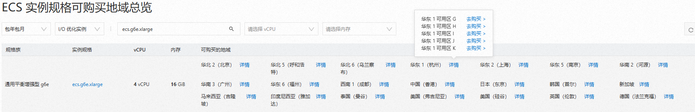

# 地域可用区选择指南与支持列表-云服务器 ECS-阿里云

[官方文档](https://help.aliyun.com/)

本文介绍云服务器 ECS 支持的地域和可用区。

### 背景知识

* 如果您还不了解什么是地域和可用区，请提前了解相关概念 [地域和可用区](https://help.aliyun.com/document_detail/40654.html)。
* 您可以结合地图了解阿里云服务在全球的部署情况：[阿里云全球基础设施](https://infrastructure.aliyun.com/)。

### 如何选择地域

在购买云服务器 ECS 时，请结合以下因素合理选择地域。若不慎选错地域，可选择在正确地域重新创建资源并释放当前地域资源，或者参考 [跨账号和同账号ECS实例间迁移](https://help.aliyun.com/zh/smc/user-guide/migrate-servers-between-ecs-instances) 进行服务迁移。

考虑因素与选择说明：

| 考虑因素                   | 选择说明                                                                                                                                                                                                                                            |
| ---------------------- | ----------------------------------------------------------------------------------------------------------------------------------------------------------------------------------------------------------------------------------------------- |
| 地理位置和用户所在地             | 如果您希望用户有良好的访问体验，则必须考虑用户访问时的网络延迟。除了通信线路的质量外，距离是影响网络延迟的一个重要因素。用户和资源部署地域的距离越近，网络时延越低，访问速度越快。建议您基于业务场景对时延的要求选择地域。                                                                                                                                   |
| 云产品之间的内网互通要求           | 当其他云产品和 ECS 在同一地域时，您可以通过 VPC 地址访问 ECS。使用 VPC 访问 ECS 时不会产生流量费用，且访问速度比公网更快。重要：如果您已经通过购买云网络产品解决了多个云产品之间的网络连接限制，请忽略该因素。如果您的服务没有内网互通要求，可以将其部署在不同地域或同一地域。如果您的服务要求内网互通，请将其部署在同一地域。                                                                     |
| 中国地区 ECS 访问其他国家和地区 ECS | 中国地区（包含中国香港、中国澳门，不包含中国台湾）的云服务器 ECS 通过公网 IP 访问其他国家和地区的云服务器 ECS 会有较高的访问延迟，极限情况下可能会产生丢包。建议您采用同 Region 部署业务。                                                                                                                                        |
| 资源价格                   | 因各地域的优惠政策不同，某些地域的资源包价格会更优惠。选择 ECS 地域时可优先考虑资源包价格更优惠的地域。不同地域的资源价格可能有差异，请参见阿里云产品详情页或者产品购买页的价格信息。更多信息，请参见 [实例购买页](https://ecs-buy.aliyun.com/wizard/?spm=a2c4g.11186623.0.0.500866a9p51WLS#/) 和 [云服务器ECS定价页](https://www.aliyun.com/price/product)。 |
| 产品功能                   | ECS 的新功能在发布初期会选择部分地域进行公测，如果您希望试用这些新功能，需在指定地域创建 ECS。ECS 产品功能发布记录请参见 [ECS 新功能发布记录](/broken/pages/6a784655e941c50d89e9c509e06f9f3560c21c0a)。                                                                                                       |
| 经营性备案                  | 如果您在北京或广东使用 ECS 实例，并用作 Web 服务器，您需要完成经营性备案，同时需要在指定的地域购买 ECS 实例。北京地区的业务：请在华北2（北京）地域购买 ECS 实例。广东地区（除深圳）的业务：请在华南1（深圳）地域购买 ECS 实例。重要：各省（或市）通信管理局对经营性备案的审批要求不同，如果有变化，请以当地管理局经营性备案网站公示内容为准。                                                            |

### 如何选择可用区

重要：您在创建或购买阿里云资源时需要选择部署的可用区，资源创建或购买成功后不能直接更换可用区。如果您想要更换 ECS 实例的可用区，可通过迁移方式实现。具体操作，请参见 [跨可用区更改实例规格](/broken/pages/4d62d737f0aa8a9597d743d732bac137a0704ddb)。

在同一地域内，可用区与可用区之间内网互通。各可用区之间可以实现故障隔离，即如果一个可用区出现故障，则不会影响其他可用区的正常运行。是否将实例放在同一可用区内，主要取决于您的应用对容灾能力和网络延时的要求。

* 如果您的应用需要较高的容灾能力，建议您将实例部署在同一地域的不同可用区内。
* 如果您的应用要求实例之间的网络延时较低，建议您将实例创建在同一可用区内。

下面为示意图，展示典型的多可用区容灾架构（ECS 和 NAS 同时采用多可用区主备方案，确保服务高可用）：



### 支持地域和可用区列表

重要：如下表格列出的地域和可用区是云服务器 ECS 支持的所有地域和可用区。不同云产品支持的地域和可用区可能不同，如果您想了解某个云产品支持的地域和可用区，请参见对应云产品的相关文档。

中国地区

| 地域名称             | 地域ID           | 可用区数量 | 可用区名称        | 可用区ID            |
| ---------------- | -------------- | ----: | ------------ | ---------------- |
| 华北1（青岛）          | cn-qingdao     |     2 | 青岛 可用区B      | cn-qingdao-b     |
|                  |                |       | 青岛 可用区C      | cn-qingdao-c     |
| 华北2（北京）          | cn-beijing     |    12 | 北京 可用区A      | cn-beijing-a     |
|                  |                |       | 北京 可用区B      | cn-beijing-b     |
|                  |                |       | 北京 可用区C      | cn-beijing-c     |
|                  |                |       | 北京 可用区D      | cn-beijing-d     |
|                  |                |       | 北京 可用区E      | cn-beijing-e     |
|                  |                |       | 北京 可用区F      | cn-beijing-f     |
|                  |                |       | 北京 可用区G      | cn-beijing-g     |
|                  |                |       | 北京 可用区H      | cn-beijing-h     |
|                  |                |       | 北京 可用区I      | cn-beijing-i     |
|                  |                |       | 北京 可用区J      | cn-beijing-j     |
|                  |                |       | 北京 可用区K      | cn-beijing-k     |
|                  |                |       | 北京 可用区L      | cn-beijing-l     |
| 华北3（张家口）         | cn-zhangjiakou |     3 | 张家口 可用区A     | cn-zhangjiakou-a |
|                  |                |       | 张家口 可用区B     | cn-zhangjiakou-b |
|                  |                |       | 张家口 可用区C     | cn-zhangjiakou-c |
| 华北5（呼和浩特）        | cn-huhehaote   |     2 | 呼和浩特 可用区A    | cn-huhehaote-a   |
|                  |                |       | 呼和浩特 可用区B    | cn-huhehaote-b   |
| 华北6（乌兰察布）        | cn-wulanchabu  |     3 | 乌兰察布 可用区A    | cn-wulanchabu-a  |
|                  |                |       | 乌兰察布 可用区B    | cn-wulanchabu-b  |
|                  |                |       | 乌兰察布 可用区C    | cn-wulanchabu-c  |
| 华东1（杭州）          | cn-hangzhou    |     8 | 杭州 可用区B      | cn-hangzhou-b    |
|                  |                |       | 杭州 可用区E      | cn-hangzhou-e    |
|                  |                |       | 杭州 可用区F      | cn-hangzhou-f    |
|                  |                |       | 杭州 可用区G      | cn-hangzhou-g    |
|                  |                |       | 杭州 可用区H      | cn-hangzhou-h    |
|                  |                |       | 杭州 可用区I      | cn-hangzhou-i    |
|                  |                |       | 杭州 可用区J      | cn-hangzhou-j    |
|                  |                |       | 杭州 可用区K      | cn-hangzhou-k    |
| 华东2（上海）          | cn-shanghai    |    12 | 上海 可用区A      | cn-shanghai-a    |
|                  |                |       | 上海 可用区B      | cn-shanghai-b    |
|                  |                |       | 上海 可用区C      | cn-shanghai-c    |
|                  |                |       | 上海 可用区D      | cn-shanghai-d    |
|                  |                |       | 上海 可用区E      | cn-shanghai-e    |
|                  |                |       | 上海 可用区F      | cn-shanghai-f    |
|                  |                |       | 上海 可用区G      | cn-shanghai-g    |
|                  |                |       | 上海 可用区K      | cn-shanghai-k    |
|                  |                |       | 上海 可用区L      | cn-shanghai-l    |
|                  |                |       | 上海 可用区M      | cn-shanghai-m    |
|                  |                |       | 上海 可用区N      | cn-shanghai-n    |
|                  |                |       | 上海 可用区O      | cn-shanghai-o    |
| 华东5（南京-本地地域-关停中） | cn-nanjing     |     1 | 南京-本地地域 可用区A | cn-nanjing-a     |
| 华东6（福州-本地地域-关停中） | cn-fuzhou      |     1 | 福州-本地地域 可用区A | cn-fuzhou-a      |
| 华中1（武汉-本地地域）     | cn-wuhan-lr    |     1 | 武汉-本地地域 可用区A | cn-wuhan-lr-a    |
| 华南1（深圳）          | cn-shenzhen    |     6 | 深圳 可用区A      | cn-shenzhen-a    |
|                  |                |       | 深圳 可用区B      | cn-shenzhen-b    |
|                  |                |       | 深圳 可用区C      | cn-shenzhen-c    |
|                  |                |       | 深圳 可用区D      | cn-shenzhen-d    |
|                  |                |       | 深圳 可用区E      | cn-shenzhen-e    |
|                  |                |       | 深圳 可用区F      | cn-shenzhen-f    |
| 华南2（河源）          | cn-heyuan      |     2 | 河源 可用区A      | cn-heyuan-a      |
|                  |                |       | 河源 可用区B      | cn-heyuan-b      |
| 华南3（广州）          | cn-guangzhou   |     2 | 广州 可用区A      | cn-guangzhou-a   |
|                  |                |       | 广州 可用区B      | cn-guangzhou-b   |
| 西南1（成都）          | cn-chengdu     |     2 | 成都 可用区A      | cn-chengdu-a     |
|                  |                |       | 成都 可用区B      | cn-chengdu-b     |
| 中国香港             | cn-hongkong    |     3 | 香港 可用区B      | cn-hongkong-b    |
|                  |                |       | 香港 可用区C      | cn-hongkong-c    |
|                  |                |       | 香港 可用区D      | cn-hongkong-d    |

其他国家和地区

| 地域名称             | 地域ID           | 可用区数量 | 可用区名称     | 可用区ID           |
| ---------------- | -------------- | ----: | --------- | --------------- |
| 新加坡              | ap-southeast-1 |     3 | 新加坡 可用区A  | ap-southeast-1a |
|                  |                |       | 新加坡 可用区B  | ap-southeast-1b |
|                  |                |       | 新加坡 可用区C  | ap-southeast-1c |
| 马来西亚（吉隆坡）        | ap-southeast-3 |     3 | 吉隆坡 可用区A  | ap-southeast-3a |
|                  |                |       | 吉隆坡 可用区B  | ap-southeast-3b |
|                  |                |       | 吉隆坡 可用区C  | ap-southeast-3c |
| 印度尼西亚（雅加达）       | ap-southeast-5 |     3 | 雅加达 可用区A  | ap-southeast-5a |
|                  |                |       | 雅加达 可用区B  | ap-southeast-5b |
|                  |                |       | 雅加达 可用区C  | ap-southeast-5c |
| 菲律宾（马尼拉）         | ap-southeast-6 |     2 | 马尼拉 可用区A  | ap-southeast-6a |
|                  |                |       | 马尼拉 可用区B  | ap-southeast-6b |
| 泰国（曼谷）           | ap-southeast-7 |     2 | 曼谷 可用区A   | ap-southeast-7a |
|                  |                |       | 曼谷 可用区B   | ap-southeast-7b |
| 日本（东京）           | ap-northeast-1 |     3 | 东京 可用区A   | ap-northeast-1a |
|                  |                |       | 东京 可用区B   | ap-northeast-1b |
|                  |                |       | 东京 可用区C   | ap-northeast-1c |
| 韩国（首尔）           | ap-northeast-2 |     2 | 首尔 可用区A   | ap-northeast-2a |
|                  |                |       | 首尔 可用区B   | ap-northeast-2b |
| 美国（硅谷）           | us-west-1      |     2 | 硅谷 可用区A   | us-west-1a      |
|                  |                |       | 硅谷 可用区B   | us-west-1b      |
| 美国（弗吉尼亚）         | us-east-1      |     2 | 弗吉尼亚 可用区A | us-east-1a      |
|                  |                |       | 弗吉尼亚 可用区B | us-east-1b      |
| 德国（法兰克福）         | eu-central-1   |     3 | 法兰克福 可用区A | eu-central-1a   |
|                  |                |       | 法兰克福 可用区B | eu-central-1b   |
|                  |                |       | 法兰克福 可用区C | eu-central-1c   |
| 英国（伦敦）           | eu-west-1      |     2 | 伦敦 可用区A   | eu-west-1a      |
|                  |                |       | 伦敦 可用区B   | eu-west-1b      |
| 阿联酋（迪拜）          | me-east-1      |     2 | 迪拜 可用区A   | me-east-1a      |
|                  |                |       | 迪拜 可用区B   | me-east-1b      |
| 沙特（利雅得） - 合作伙伴运营 | me-central-1   |     2 | 利雅得 可用区A  | me-central-1a   |
|                  |                |       | 利雅得 可用区B  | me-central-1b   |
| 墨西哥              | na-south-1     |     1 | 墨西哥 可用区A  | na-south-1a     |

### 查询开服地域

您可以调用 [DescribeRegions](/broken/pages/ac8649010b8746140676142363283c024e2ea6d1) 接口查询云服务器 ECS 支持售卖的开服地域。

CLI 命令参考如下，请用上方表格中的 `地域ID` 对 `{RegionId}` 进行替换。

```shell
aliyun ecs DescribeRegions --region {RegionId}
```

### 查询可用区资源列表

您可以调用 [DescribeZones](/broken/pages/7ab09d43be7c67cfdd1c91ca90ed9220e7ca155b#DAS) 接口查询云服务器 ECS 在指定地域的可用区信息及支持售卖的资源信息。

CLI 命令参考如下，请用上方表格中的 `地域ID` 对 `{RegionId}` 进行替换。

```shell
aliyun ecs DescribeZones --region {RegionId}
```

### 查询实例可购买地域

各个地域下可供售卖的实例规格可能存在差异，您可以前往 [ECS 实例可购买地域](https://ecs-buy.aliyun.com/instanceTypes/#/instanceTypeByRegion) 查看特定规格的实例在各地域的售卖情况。



### 地域与服务接入点的关系

服务接入点（Endpoint）是云服务器 ECS 提供对外服务的访问域名，包括公网接入地址和 VPC 接入地址。在业务系统中集成云服务器 ECS 时，您必须在编程工具（SDK、CLI、API 等）中配置服务接入点（Endpoint），完成与服务端通信。关于云服务器 ECS 支持的服务接入点（Endpoint），请参见：

* 如果您想对实例、镜像、块存储等资源进行管理，请参考 [ECS API 服务接入点](/broken/pages/f8743221c90e2408407b94cdd7c62d2456f71d6a#DAS)。
* 如果您想使用块存储的高级功能，请参考 [EBS API 服务接入点](/broken/pages/5a4e65eea50d09c5c6c4448a96c705843df1b9be)。

***

如果需要我将某个表格导出为单独页面或将某一地域的可用区列表转换为可折叠块（Expandable），告诉我您想要的地域或格式。
