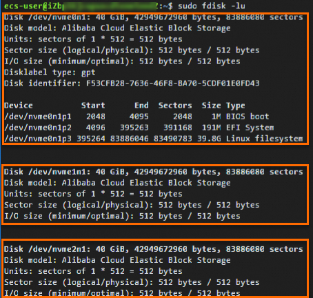

# ECS实例使用NVMe协议访问云盘存储-NVMe协议-云服务器 ECS-阿里云

当您的ECS实例需要通过NVMe协议来提升存储性能时，可以通过本文了解对ECS实例规格、镜像以及云盘的限制约束及相关操作，从而创建符合要求的ECS实例。

非易失性存储器标准接口NVMe（Non-Volatile Memory Express）是一种专为固态存储（如基于闪存的SSD）设计的高速接口协议，支持存储设备直接与CPU通信，减少数据传输延迟。当ECS实例基于NVMe协议挂载云盘时，显著降低了I/O访问的延迟时间。

### 使用限制

ECS实例使用NVMe协议时，对实例规格族、镜像以及云盘的要求如下：

| **资源** | **限制说明**                                                                                                                                                                                                                                                                                                                                                                                                                                                                                  |
| ------ | ----------------------------------------------------------------------------------------------------------------------------------------------------------------------------------------------------------------------------------------------------------------------------------------------------------------------------------------------------------------------------------------------------------------------------------------------------------------------------------------- |
| 实例规格族  | 
实例规格族需要默认支持NVMe协议。 <strong>说明</strong> 您可以通过 <a href="/broken/pages/88c026b43f8e966d1ace4252c3f3c6c7d249ec65#doc-api-Ecs-DescribeInstanceTypes">DescribeInstanceTypes</a> 接口查询实例规格族，再根据查询结果中的NvmeSupport参数确认实例规格族是否支持NVMe。
                                                                                                                                                                                                                                                   |
| 镜像     | 
镜像需要包含NVMe驱动。 <strong>说明</strong> - 您可以通过API接口 <a href="/broken/pages/2a26cc21355e421143d0b882e3fa735c4e451569">DescribeImages</a> 中的<code>NvmeSupport</code>参数确认镜像是否支持NVMe。  - 如果您的自定义镜像没有安装NVMe驱动，可以参考 <a href="/broken/pages/a8d5e6f1ea49559de5a70e036677ec5603c12758">如何为已有自定义镜像安装NVMe驱动？</a> 安装NVMe驱动。
                                                                                                                                                            |
| 云盘     | 
仅支持 <a href="user-guide/sui-ji-du-xie-kuai-cun-chu-rong-liang-essd-yun-pan-yun-fu-wu-qi-ecsali-yun.md">ESSD云盘</a> 和 <a href="rong-liang-xing-neng-jie-ou-de-yun-pan-cun-chu-essd-autopl-yun-pan-yun-fu-wu-qi-ecsali-yun.md">ESSD AutoPL云盘</a>。 <strong>说明</strong> - 支持NVMe协议的云盘被称为NVMe云盘。  - 开启多重挂载功能的NVMe云盘被称为NVMe共享盘。NVMe共享盘支持挂载到多台ECS实例上，从而实现数据共享。更多信息，请参见 <a href="yun-pan-duo-chong-gua-zai-gong-neng-shi-yong-zhi-nan-yun-fu-wu-qi-ecsali-yun.md">云盘多重挂载功能</a>.
 |

### 计费说明

NVMe协议不会产生额外费用，支持NVMe协议的相关资源仍保持各资源原有的计费方式。关于ECS资源计费的更多信息，请参见 [计费概述](ji-fei-gui-ze-ding-jia-yu-cheng-ben-guan-li-yun-fu-wu-qi-ecsali-yun.md#concept-isb-scd-5db)。

### 相关操作

在使用NVMe协议提升ECS实例的存储性能时，可能涉及如下相关操作：

| **相关操作**                                     | **说明**                                                                                                                                                                                                                                                                                                                                |
| -------------------------------------------- | ------------------------------------------------------------------------------------------------------------------------------------------------------------------------------------------------------------------------------------------------------------------------------------------------------------------------------------- |
| 创建支持NVMe协议的ECS实例                             | [自定义购买实例](/broken/pages/b6b33d4cf4d7c96e4733f8ff6424cc84d1e794fa#task-vwq-5g4-r2b) 时，可以随实例一起创建ESSD云盘或ESSD AutoPL云盘。                                                                                                                                                                                                                   |
| 单独购买ESSD云盘、ESSD AutoPL云盘或ESSD同城冗余云盘并挂载至ECS实例 | 参见下方操作步骤。                                                                                                                                                                                                                                                                                                                             |
| 初始化NVMe云盘                                    | 
随实例一起创建的或单独购买的NVMe云盘需要初始化才能使用。更多信息，请参见 <a href="/broken/pages/d96b94fa0845b69d631174a68940dc8ae94efc59">初始化数据盘</a>。 <strong>说明</strong> 初始化NVMe云盘时，云盘的设备名称和分区名称与其他云盘不同。更多信息，请参见 <a href="ecs-shi-li-shi-yong-nvme-xie-yi-fang-wen-yun-pan-cun-chu-nvme-xie-yi-yun-fu-wu-qi-ecsali-yun.md#ee892f302cnh4">NVMe云盘的设备名称</a>。
 |



### 创建空数据盘

请参见文档：[创建空数据盘](/broken/pages/8c5c1b2ba730972aa64ec1ad62c2890c96af81d5)

说明：单独创建ESSD云盘或ESSD AutoPL云盘时，可选择开启多重挂载功能。更多信息，请参见 [云盘多重挂载功能](yun-pan-duo-chong-gua-zai-gong-neng-shi-yong-zhi-nan-yun-fu-wu-qi-ecsali-yun.md#task-2085284)。



### 挂载数据盘

请参见文档：[挂载数据盘](/broken/pages/b65767a12e8f8fecace9b38f94b8c994431cca8e)



其他更多操作与云盘类似，请参见 [云盘基础操作](/broken/pages/120e349d4eaae717225a0c7d672b46f4970f70e5)。

### NVMe云盘的设备名称

当Linux实例基于NVMe协议挂载了ESSD云盘或ESSD AutoPL云盘时，云盘的设备名称和分区名称与其他云盘不同，您可以运行 `sudo fdisk -lu` 命令查看。

如下说明该实例挂载了三块云盘：

* 云盘的设备名称显示为 /dev/nvmeXn1：
  * 系统盘：/dev/nvme0n1
  * 数据盘：/dev/nvme1n1 和 /dev/nvme2n1，以此类推。
* 云盘的分区名称显示为 <设备名称>p<分区号>，例如系统盘 /dev/nvme0n1 有 3 个分区，分区名称分别为 /dev/nvme0n1p1、/dev/nvme0n1p2 和 /dev/nvme0n1p3。

### 相关文档

* 您可以通过 [查看块存储序列号](/broken/pages/0a8bec07f28a7bf914d3cd063ddb8d5b9a398d71) 查询NVMe云盘的序列号。
* [存储I/O性能](/broken/pages/8bf2f33d0262c04eb4415b3583b91cd33d462c96)
* [管理云盘](/broken/pages/120e349d4eaae717225a0c7d672b46f4970f70e5)

如果需要更多帮助，请参阅页面中列出的相关文档链接。
