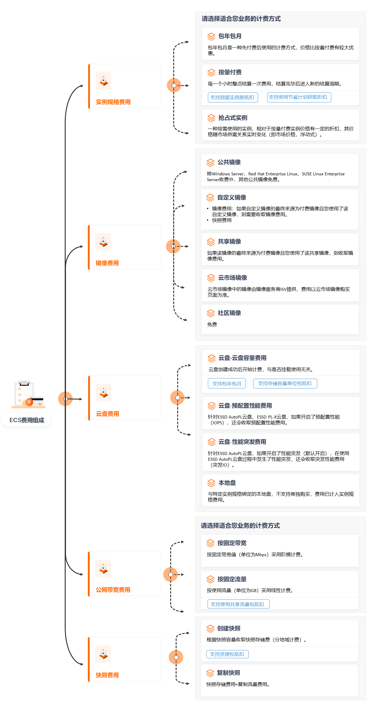

# 计费规则定价与成本管理-云服务器 ECS-阿里云

通过阅读本文，您可以快速了解云服务器 ECS 的计费项及其计费方式、计费组成、定价等主要计费信息。

### 计费项及其计费方式

一台 ECS 实例包括计算资源（vCPU 和内存）、镜像、块存储等资源，其中涉及计费的 ECS 资源如下表所示。

| **资源类型**       | **计费说明**                                                                                                                                     | **计费方式**                                                                                                                         | **计费规则**     |
| -------------- | -------------------------------------------------------------------------------------------------------------------------------------------- | -------------------------------------------------------------------------------------------------------------------------------- | ------------ |
| 计算资源（vCPU 和内存） | 
以实例规格的形式提供计算资源，包括 vCPU 和内存，收取实例规格费用。 <strong>重要</strong>：计算资源为基础配置费用，按量付费的 ECS 实例，即使未运行业务，也会按照计费周期持续计费。除非开启节省停机模式。更多信息，请参见 节省停机模式。
 | 
- 包年包月 - 按量付费 - 抢占式实例 - 按量付费+预留实例券 - 按量付费+节省计划
                                                                | 实例规格（计算资源）计费 |
| 镜像             | 根据镜像类型以及使用情况决定是否收费。                                                                                                                          | 
- 包年包月 - 按量付费 - 按量付费+预留实例券（公共镜像） <strong>说明</strong>：镜像只能和 ECS 实例搭配使用，Windows 类型的预留实例券在购买时包含了公共镜像费用，可以抵扣公共镜像的账单。
 | 镜像计费         |
| 块存储            | 
按云盘容量和使用时长收取费用。 <strong>说明</strong>：本地盘与特定实例规格绑定，不支持单独购买，费用已计入实例规格费用。
                                                              | 
- 包年包月 - 按量付费 - 存储容量单位包 SCU - 按量付费+节省计划
                                                                          | 块存储计费        |
| 公网带宽           | 
使用固定公网 IP 访问公网时，仅收取公网出网带宽费用。 <strong>说明</strong>：如果使用弹性公网 IP（EIP）或 NAT 网关访问公网，计费相关详情见对应文档。
                                         | 
- 按固定带宽 - 按使用流量
                                                                                                        | 公网带宽计费       |
| 快照             | 
- 创建快照：根据快照容量收取快照存储费（分地域计费）。 - 复制快照：快照存储费用 + 复制流量费用。
                                                                               | 
- 按量付费 - 存储容量单位包 SCU - 标准（LRS）存储包
                                                                                   | 快照计费         |

说明：ECS 资源的基础计费方式为包年包月和按量付费，针对不同的 ECS 资源，您可以根据需要结合其他优惠的计费方式来降低使用成本。更多信息请参见 计费方式概述。

（注：上表中“实例规格（计算资源）计费”“镜像计费”“块存储计费”“公网带宽计费”“快照计费”等为文档内相关节，原文包含具体链接。）

### 计费组成

ECS 的计费项组成如下图：

### 产品定价

不同地域的实例价格请参见 云服务器 ECS 定价 中的 实例价格 页签。

### 转换计费方式

在购买 ECS 资源后，如果发现当前计费方式无法满足业务需求，您可以转换计费方式。支持转换的 ECS 资源如下表所示。

| **ECS 资源** | **转换说明**                                                                                                                                                                                                                                         | **相关文档**                                        |
| ---------- | ------------------------------------------------------------------------------------------------------------------------------------------------------------------------------------------------------------------------------------------------ | ----------------------------------------------- |
| 实例         | 
转换实例计费方式会同时转换计算资源（vCPU 和内存）、系统盘等资源的计费方式。 - 将实例的计费方式从包年包月转为按量付费，可以回收部分成本，更加灵活地使用 ECS。 <strong>说明</strong>：阿里云会根据您的云服务器使用情况，通过计算动态得出您的实例的计费方式是否支持转换操作。您可以前往云服务器控制台查看是否存在相应的操作入口，如果不存在，则说明不支持。 - 将实例的计费方式从按量付费转为包年包月，可以享受一定程度的价格优惠。
 | 
- 包年包月转按量付费 - 按量付费转包年包月
               |
| 云盘         | 
- 包年包月实例上挂载的数据盘可以单独转换计费方式。 - 实例系统盘以及按量付费实例上挂载的数据盘需随实例一起转换计费方式。
                                                                                                                                                                         | 
- 转换云盘计费方式 - 包年包月转按量付费 - 按量付费转包年包月
 |
| 公网带宽       | 使用固定公网 IP 的实例，可以通过升降配功能转换带宽的计费方式。                                                                                                                                                                                                                | 转换固定公网 IP 的带宽计费方式                               |

（注：表中“相关文档”在原文为可点击链接，保留原文链接内容可在需要时查阅。）

### 查看费用账单

您可以在 费用与成本 中查看 ECS 实例相关的费用账单和消费明细，以了解消费情况。具体操作，请参见 账单查询。

### 续费实例

包年包月实例到期后会影响实例正常运行。如果您想继续使用实例，需要在指定时间内为实例续费，否则 vCPU、内存、云盘等资源会自动释放，数据将会丢失。续费相关的更多信息，请参见 如何续费包年包月实例。

### 欠费说明

账号的可用额度（含阿里云账户余额和代金券）小于待结算的账单时，会被判定为账号欠费。欠费后，可能会影响实例正常运行，请及时充值。

* 包年包月 ECS 资源：您已经预先支付了资源费用，因此账号欠费后，您可以正常使用已有的包年包月 ECS 资源。但对于新购实例、升级实例配置、续费订单等涉及费用的操作，您无法正常进行。
* 按量付费 ECS 资源：账号欠费会导致按量付费 ECS 实例停机，欠费停机期间相关 ECS 资源暂停计费。如果未在规定时间内充值结清欠费账单并重开机，您将不能正常使用 ECS 资源。

### 支付与退款

购买 ECS 资源时，您可以选择以下支付方式：

* 阿里云账户余额
* 在线支付
* 优惠券

通过 API CreateInstance 创建包年包月实例时，不能使用信用卡支付。

优惠券的使用方式与规则请参见 查看并使用优惠券。优惠券用于在出账前抵扣消费金额，因此并不涉及实际支付动作。

购买使用 ECS 资源后，您可以查看账单和消费情况，具体请参见 账单查询。

如果您想要退订产品，请先了解相关退款规则，具体请参见 退订说明。

### 成本优化最佳实践

使用云服务器 ECS 时，成本主要包括拥有成本和运维成本。您可以从归集成本、优化资源、升级换代、具备节约意识、实现自动化运维等方面优化成本。更多详情，请参见 成本优化最佳实践。

### 计费常见问题

计费 FAQ

如在购买或使用云服务器 ECS 过程中遇到计费相关问题，请参见 计费 FAQ 获取帮助。

更多参考（原文包含以下相关导航与链接，可按需访问）：

* 官方文档：https://help.aliyun.com/
* 云服务器 ECS 总入口：https://help.aliyun.com/zh/ecs/
* 用户指南、开发参考、产品计费、常见问题、动态与公告（原文包含对应链接）

（本文保留原文中指向阿里云帮助中心的链接，未对链接内容作修改。）
