# 计费规则价格计算与账单-云服务器 ECS-阿里云

抢占式实例采用先使用后付费，市场价格根据供需关系实时变化，相对于按量付费最高能节约90%的成本。

## 计费项

抢占式实例的计费项仅包含实例规格，不包含镜像、云盘、公网带宽（按固定带宽）、快照等。

## 计费规则

### 计费时长与价格构成

* 计费时长：从成功创建到释放抢占式实例的时长。
* 市场价格：指的是实例规格的价格，不包括云盘、公网带宽等资源的价格。
* 出价：是您愿意为所选购的抢占式实例支付的最高价格。

说明：出价并非实例的实际计费价格，实际计费是以市场价格来计算。

### 实例使用时长设置对比

| 实例使用时长设置 | 设定实例使用1小时                                                                                                                   | 无确定使用时长                                                                                                                     |
| -------- | --------------------------------------------------------------------------------------------------------------------------- | --------------------------------------------------------------------------------------------------------------------------- |
| 计费示意图    |  |  |
| 说明       | 阿里云会保障实例在创建后1小时内不会被自动释放；超过1小时后，系统实时比较出价与市场价格、检查资源库存，来决定实例的持有和回收。                                                            | 实例在创建后的运行时长没有保障，系统会立即实时比较出价与市场价格、检查资源库存，来决定实例的持有和回收。                                                                        |
| 实例计费价格   | 
- 计费时长 ≤ 1小时：成交时的市场价格 - 计费时长 > 1小时：各时段的市场价格
                                                                       | 各时段的市场价格                                                                                                                    |
| 计费公式     | 
- 计费时长 ≤ 1小时：成交时的市场价格 * 计费时长 - 计费时长 > 1小时：成交时的市场价格 * 1小时 + ∑（各时段市场价格 * 各时段计费时长）
                                   | ∑（各时段市场价格 \* 各时段计费时长）                                                                                                       |

说明：相同实例规格的情况下，“无确定使用时长”在市场价格上会比“设定实例使用1小时”的抢占式实例优惠一些，与是否超过设定使用时长无关。

### 计费周期

按秒计算费用，按整点小时区间产生一条消费明细。

## 计费示例

说明：市场价格随供需变动，变动的时间周期不定，以下仅为示例。



### 场景1：设定实例使用1小时

假设您在 9:40 出价（设置单台上限价）6元/小时，以5元/小时的市场价格成功竞得了一台抢占式实例，设定实例使用1小时，实例在 11:00 时由于出价小于市场价格被通知中断回收并在5分钟后释放。

说明：抢占式实例根据实际使用时长按秒级来累计计算费用，小时价格除以3600即可得到每秒的价格。实际使用时长为5100秒（9:40\~11:05），超过1小时，1小时内的计费价格为成交时市场价格，即5元/小时；1小时后，中断回收前计费价格为各时段市场价格。实际产生费用如下：

* 使用1小时费用 = 成交时的市场价格 \* 计费时长\
  9:40\~10:40（成交时市场价格5元/小时、使用3600秒）：（5/3600）\*3600 = 5元。
* 使用1小时后费用 = ∑（各时段市场价格 \* 各时段计费时长）\
  10:40~~11:00（市场价格6元/小时、使用1200秒）：（6/3600）\*1200 = 2元。~~\
  ~~11:00~~11:05（市场价格8元/小时、使用300秒）：（8/3600）\*300 = 0.67元。

总费用 = 5 + 2 + 0.67 = 7.67元。




### 场景2：设定无确定使用时长

假设您在 9:40 出价跟随市场价格（使用自动出价），以4元/小时的市场价格成功竞得了一台抢占式实例，设定无确定使用时长，实例在 11:00 时由于库存不足被通知中断回收并在5分钟后释放。

说明：抢占式实例根据实际使用时长按秒级来累计计算费用，小时价格除以3600即可得到每秒的价格。实际使用时长为5100秒（9:40\~11:05），计费价格为各时段市场价格。实际产生费用如下：

计费时长内费用 = ∑（各时段市场价格 \* 各时段计费时长）

* 9:40\~10:00（市场价格4元/小时、使用1200秒）：（4/3600）\*1200 = 1.33元。
* 10:00\~11:00（市场价格5元/小时、使用3600秒）：（5/3600）\*3600 = 5元。
* 11:00\~11:05（市场价格6元/小时、使用300秒）：（6/3600）\*300 = 0.5元。

总费用 = 1.33 + 5 + 0.5 = 6.83元。




## 账单查询

请参见 [查看抢占式实例账单](/broken/pages/a451a23b141acee690eb721d08422c66508ddb96#section-h5i-gdu-dnm)。

## 欠费说明

如果账号内存在欠费账单，您无法正常使用抢占式实例资源。欠费会导致 ECS 实例停机，甚至释放资源。请尽快充值结清欠费账单，避免因资源的停机或释放而影响业务。

## 相关文档

* [什么是抢占式实例](/broken/pages/37a1d00bec9c31514034d0907b379d356d8bb750#concept-t3p-gv2-5db)
* [创建抢占式实例](/broken/pages/3fd9896c5526954c0d205db17c491b25238ea7d1)
* [抢占式实例最佳实践](/broken/pages/78c81faea3f3056eb739e86b4feeaded41b7cfd8)
