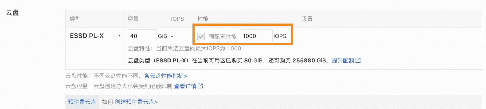
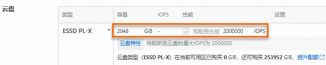

# 可自定义IOPS性能的块存储-ESSD PL-X云盘-云服务器 ECS-阿里云

[官方文档](https://help.aliyun.com/)

阿里云 ESSD PL-X 云盘文档概览与导读

阿里云ESSD PL-X是一款具备超高 IOPS、超高吞吐量和超低时延等多维度高性能的云盘。您可以在配置 ESSD PL-X 云盘容量的同时，根据业务需求灵活自定义云盘的 IOPS。本文主要介绍 ESSD PL-X 云盘的规格、计费、配置操作和使用限制等信息。

### 云盘简介

#### 云盘规格

ESSD PL-X 云盘规格说明如下表所述：

| 类别            | 云盘属性                               | 规格说明       |
| ------------- | ---------------------------------- | ---------- |
| 云盘容量          | 单盘容量范围（GiB）                        | 40\~32,768 |
| 云盘性能          | 单个 I/O 大小（KB）                      | 4          |
| 单路随机写平均时延（ms） | 0.03                               |            |
| 单盘 IOPS       | min{预配置IOPS, 3,000,000}            |            |
| 单盘吞吐量（MB/s）   | min{4 KB \* 预配置IOPS / 1024，12,288} |            |

说明：单盘性能上限为 1,000 IOPS/GiB。性能测试方法，请参见 测试ESSD PL-X云盘性能：https://help.aliyun.com/zh/ecs/user-guide/test-essd-pl-x-cloud-disk-performance#task-2194412

#### 应用场景

ESSD PL-X 云盘适用于对云盘性能（IOPS、吞吐量和时延）有更高要求的 OLTP（Online Transaction Processing）数据库和 KV 数据库。

#### 计费说明

* 计费项及计费规则\
  ESSD PL-X 云盘费用包括：云盘容量费（创建即收费）+ 预配置性能费（配置 IOPS，默认开启且无法关闭）。详细计费规则，请参见：块存储计费 https://help.aliyun.com/zh/ecs/block-storage-devices#concept-1937442
* 定价\
  ESSD PL-X 云盘的定价详情，请参见：块存储定价 https://www.aliyun.com/price/product#/disk/detail

### 使用限制

#### 地域限制

仅支持华东2（上海）的 M 可用区。如有需求，请联系阿里云销售人员。

#### 实例规格限制

ESSD PL-X 云盘仅支持 ecs.g8ise 实例规格族。关于该规格族的更多信息，请参见：存储增强通用型实例规格族 g8ise https://help.aliyun.com/zh/ecs/user-guide/overview-of-instance-families#g8ise

#### 功能限制

相较于 ESSD PL0\~PL3 云盘，使用 ESSD PL-X 云盘时，存在以下限制项：

| 限制项       |                                                                                                                      ESSD PL-X 是否支持 | ESSD PL0\~PL3 是否支持 |
| --------- | ----------------------------------------------------------------------------------------------------------------------------------: | -----------------: |
| 创建云盘      |                                                                                                                                   是 |                  是 |
| 删除云盘      |                                                                                                                                   是 |                  是 |
| 查看/修改云盘属性 |                                                                                                                                   是 |                  是 |
| 加密云盘      |                                                                                                                                   否 |                  是 |
| 多重挂载      |                                                                                                                                   否 |                  是 |
| 云盘异步复制    |                                                                                                                                   否 |                  是 |
| 创建快照      |                                                                                                                                   否 |                  是 |
| 重置云盘      |                                                                                                                                   否 |                  是 |
| 初始化云盘     |                                                                                                                                   是 |                  是 |
| 更换系统盘     |                                                                                                                                   否 |                  是 |
| 云盘扩容      |                                                                                                                                   是 |                  是 |
| 挂载云盘      |                                                                                                                                   是 |                  是 |
| 修改云盘计费类型  |                                                                                               是（说明：仅支持修改容量部分的计费类型，性能部分仅支持按量付费计费类型。） |                  是 |
| 变更云盘类型    | 否（说明：仅支持通过变更云盘类型功能修改 IOPS 的大小。更多信息，请参见 变更云盘类型：https://help.aliyun.com/zh/ecs/user-guide/change-the-category-of-a-disk#task-2473687） |                  是 |
| 修改性能级别    |                                                                                                                                   否 |                  是 |

### 配置云盘预配置性能

当您在 ECS 管理控制台上创建 ESSD PL-X 云盘，或者在创建 ECS 实例添加 ESSD PL-X 数据盘时，可以根据业务需求自定义云盘的 IOPS 大小以提升性能。创建 ECS 实例和创建云盘的具体操作，请参见：自定义购买实例 https://help.aliyun.com/zh/ecs/user-guide/create-an-instance-by-using-the-wizard#task-vwq-5g4-r2b 和 创建空数据盘 https://help.aliyun.com/zh/ecs/user-guide/create-a-disk/#concept-jx1-tx1-ydb

下面以在 ECS 管理控制台上创建 ESSD PL-X 云盘为例，介绍如何自定义配置 ESSD PL-X 云盘的 IOPS 性能：



### 步骤一

访问 ECS 控制台-云盘：https://ecs.console.aliyun.com/disk/



### 步骤二

在页面左侧顶部，选择目标资源所在的资源组和地域。\




### 步骤三

单击 创建云盘。



### 步骤四

在云盘购买页面中，设置 ESSD PL-X 云盘的配置参数：

* 选择云盘类型为 ESSD PL-X，配置云盘容量。
* 预配置性能默认开启且无法修改，您可以根据实际需求配置 IOPS 的大小。为保证云盘顺利创建，在创建云盘时，请确保设置的预配置性能不低于 1,000 IOPS。

说明：云盘创建成功后，您可以通过变更云盘类型功能来修改 IOPS 的大小。更多信息，请参见：变更云盘类型 https://help.aliyun.com/zh/ecs/user-guide/change-the-category-of-a-disk#task-2473687

其他详细的参数配置，请参见：创建空数据盘 https://help.aliyun.com/zh/ecs/user-guide/create-a-disk/#concept-jx1-tx1-ydb




### ESSD PL-X 云盘计费示例

以下为配置 ESSD PL-X 云盘的 IOPS 后，云盘的性能指标以及产生的费用示例，供参考：

张先生购买了容量为 2,048 GiB，性能为 2,000,000 IOPS 的 ESSD PL-X 云盘，付费模式为包年包月，购买时长 1 个月。

* 该云盘的性能指标如下：
  * 云盘 IOPS：2,000,000 IOPS
  * 云盘吞吐量：4 KB \* 预配置IOPS / 1,024 = 4 KB \* 2,000,000 / 1,024 / 1,024 = 7.62 GB/s\
    吞吐量的计算公式，请参见：云盘简介 https://help.aliyun.com/zh/ecs/user-guide/essd-pl-x-cloud-disk#section-xrk-e1h-s6y
* 使用该云盘 1 个月的费用示例（定价详情请参见：块存储定价 https://www.aliyun.com/price/product#/disk/detail）：
  * 云盘容量费用：云盘容量 \* 云盘单价 \* 购买时长 = 2,048 \* 1 \* 1 = 2,048 元
  * 云盘性能费用：性能单价 \* 预配置IOPS \* 购买时长 =（0.075/24/30）元/小时 \* 2,000,000 \*（30 \* 24）小时 = 150,000 元
  * 总费用：云盘容量费用 + 云盘性能费用 = 2,048 + 150,000 = 152,048 元

相关链接

* 上一篇：ESSD 同城冗余云盘 https://help.aliyun.com/zh/ecs/user-guide/regional-essd-disks
* 下一篇：ESSD 云盘 https://help.aliyun.com/zh/ecs/user-guide/essds

反馈\
若需进一步帮助，请访问阿里云帮助中心页面中对应链接。
