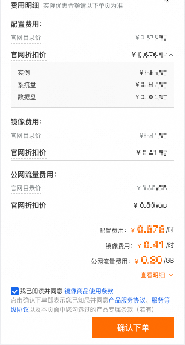

# 什么是按量付费计费方式-云服务器 ECS(ECS)-阿里云帮助中心

按量付费是一种先使用后付费的计费方式，您可以根据业务需求随时启动、停止或释放实例。本文主要介绍阿里云 ECS 云服务器按量付费的计费方式、规则及优化成本的方法。

适用场景

* 业务波动或爆发，资源使用有临时性和突发性，无法准确预测。
* 资源需随时开通，随时删除。

常见场景：临时扩展、测试、电商抢购等。

计费规则 按量付费主要包括按使用时长计费和按使用量计费（如流量）两种计费规则。假设您计划购买一台使用付费镜像的云服务器，并同时购买一块数据盘，分配了公网 IPv4 地址，选择按公网流量计费的带宽计费模式。在购买云服务器页面右下角单击查看明细，可以看到所需费用的明细。

说明 本场景仅作计费项和计费规则说明示例，实际计费项和价格以购买时显示为准。如果购买时显示的计费项与实例中不同，请根据实际配置参照计费项与计费规则。

|                                          |                                                                                                                                                                                                                                                                              |
| ---------------------------------------- | ---------------------------------------------------------------------------------------------------------------------------------------------------------------------------------------------------------------------------------------------------------------------------- |
|  | 
按照假设情况购买的实例的费用明细将包括以下部分： - 实例：实例规格费用，包括计算资源（vCPU、内存、GPU）、不可卸载的存储设备（本地盘）费用，以及功能增强组件费用，不包括付费镜像、块存储（系统盘、数据盘）、公网带宽、快照等使用费用。 - 系统盘：云盘（系统盘）费用。 - 数据盘：云盘（数据盘）费用。 - 镜像费用：镜像许可证费用，基于付费镜像的市场价格。 - 公网流量费用：公网带宽（按使用流量）费用。 您可以根据购买时的计费明细中显示的计费项对照说明查看对应计费项的计费规则。
 |

除示例中的计费项外，按量付费的实例可能会基于配置或在触发配置的功能时产生其他费用。ECS 按量付费计费项的计费公式及参数说明如下。

按使用时长计费

| 计费项                                                                   | 主要计费公式                                                                                          | 计费单价                                                                                               | 计费时长                                                                                                                                                                       | 时长计量粒度                                                                                                                                                           |
| --------------------------------------------------------------------- | ----------------------------------------------------------------------------------------------- | -------------------------------------------------------------------------------------------------- | -------------------------------------------------------------------------------------------------------------------------------------------------------------------------- | ---------------------------------------------------------------------------------------------------------------------------------------------------------------- |
| [实例规格](/broken/pages/e9f47c18f67fdeb42f0458db5f2958c07ba54f3e)        | 实例规格费用 = 实例规格单价 × 计费时长                                                                          | 同一实例规格在不同地域价格可能不同，参见[云服务器ECS定价页](https://www.aliyun.com/price/product)。                            | 
- 未启用节省停机模式：自实例创建起开始计费，至释放终止计费。 - 启用<a href="/broken/pages/77575e8f81d45af02331d284b149193de0baf54d#concept-js1-1fd-5db">节省停机模式</a>：自实例创建开始计费，实例停止时暂停计费，释放时终止计费。
 | 
按秒计算；使用时长不足最低阈值时按最短时长计费。 重要：实例规格计费时，根据实例 vCPU 核数存在最短计费时长： - 1 vCPU：不足 10 分钟按 10 分钟计费。 - 2 vCPU：不足 5 分钟按 5 分钟计费。 - 4 vCPU 及以上：不足 2 分钟按 2 分钟计费。
 |
| [镜像](/broken/pages/2a695847d8765387eac28ced7180e7ce0bb1e172)          | 镜像操作系统许可证费用 = 镜像单价 × 计费时长                                                                       | 公共镜像价格请参见[镜像计费](/broken/pages/2a695847d8765387eac28ced7180e7ce0bb1e172)。                           | 从按量付费实例创建完成开始计费，至实例释放时终止计费。                                                                                                                                                | 按秒计算计费时长。                                                                                                                                                        |
| [云盘（系统盘）](/broken/pages/1f0798a3a257f5c2ab2c04ed33b8815087bc57cf)     | 
系统盘与数据盘的计费公式相同： - 云盘容量费用 = 云盘单价 × 云盘容量 × 计费时长 - 预配置性能费用 = 配置性能单价 × 预配置 IOPS × 计费时长
 | 同一类型云盘在不同地域价格可能不同，参见[块存储价格](https://www.aliyun.com/price/product#/disk/detail)                     | 
系统盘云盘容量费用从按量付费实例创建完成开始计费，至实例释放时终止计费。 预配置性能费用自启用时开始计费，至云盘释放或预配置 IOPS 调整为 0 时终止计费。
                                                                                 | 
按秒计算计费时长；使用时长不足最低阈值时按最短时长计费。 重要：系统盘根据绑定实例规格存在最短计费时长： - 1 vCPU：不足 10 分钟按 10 分钟计费。 - 2 vCPU：不足 5 分钟按 5 分钟计费。 - 4 vCPU 及以上：不足 2 分钟按 2 分钟计费。
      |
| [云盘（数据盘）](/broken/pages/1f0798a3a257f5c2ab2c04ed33b8815087bc57cf)     | 
- 数据盘云盘容量费用从云盘创建完成开始计费，至云盘释放时终止计费。 - 预配置性能费用自启用时开始计费，至云盘释放或预配置 IOPS 调整为 0 时终止计费。
      | 与云盘（系统盘）相同，各地域价格可能不同。                                                                              | 按秒计算计费时长。                                                                                                                                                                  | 按秒计算。                                                                                                                                                            |
| [公网带宽（按固定带宽）](/broken/pages/3bc24106bebc69cf9c8609e0ea0fa883e9c03e3c) | 公网带宽费用（按固定带宽） = 固定带宽单价 × 固定带宽大小 × 计费时长                                                          | 不同地域带宽价格请参见[云服务器ECS定价](https://www.aliyun.com/price/product#/ecs/detail)的带宽价格页签。                   | 从开通公网带宽（按固定带宽）开始计费，关闭公网带宽后或到实例释放时终止计费。                                                                                                                                     | 
按秒计算计费时长；使用时长不足最低阈值时按最短时长计费。 重要：公网带宽根据绑定实例规格存在最短计费时长： - 1 vCPU：不足 10 分钟按 10 分钟计费。 - 2 vCPU：不足 5 分钟按 5 分钟计费。 - 4 vCPU 及以上：不足 2 分钟按 2 分钟计费。
     |
| [快照](/broken/pages/817a93eb5a881a1fc26c8385183752f8c7a3e0a7)          | 快照存储费用 = 快照单价 × 快照容量 × 计费时长                                                                     | 阿里云根据快照类型及对应快照容量按地域单独结算，参见[ECS 定价详情页](https://www.aliyun.com/price/product#/disk/detail)中快照服务价格页签。 | 从快照创建完成开始计费，到快照删除后终止计费。                                                                                                                                                    | 按小时计算计费时长，不足 1 小时按 1 小时计算。                                                                                                                                       |

按使用量计费

| 计费项                                                                   | 按量付费计费公式                                                                                                                                                               | 计费单价                                                                                   | 流量计量方法                       | 流量计量粒度     |
| --------------------------------------------------------------------- | ---------------------------------------------------------------------------------------------------------------------------------------------------------------------- | -------------------------------------------------------------------------------------- | ---------------------------- | ---------- |
| [公网带宽（按使用流量）](/broken/pages/3bc24106bebc69cf9c8609e0ea0fa883e9c03e3c) | 公网带宽费用（按使用流量） = 公网带宽单价 × 流量                                                                                                                                            | 线性计费，不同地域带宽价格请参见[云服务器ECS定价](https://www.aliyun.com/price/product#/ecs/detail)中的带宽价格页签。 | 按实际使用流量转化为 GB 并向下取整保留 6 位小数。 | 按 Byte 计费。 |
| [云盘（系统盘）](/broken/pages/1f0798a3a257f5c2ab2c04ed33b8815087bc57cf)     | 若云盘类型为 ESSD AutoPL，根据功能配置可能产生按量的突发性能费用，详情请参见[性能突发费用封顶规则](rong-liang-xing-neng-jie-ou-de-yun-pan-cun-chu-essd-autopl-yun-pan-yun-fu-wu-qi-ecsali-yun.md#c69ee53799gmi)。 | —                                                                                      | —                            | —          |
| [云盘（数据盘）](/broken/pages/1f0798a3a257f5c2ab2c04ed33b8815087bc57cf)     | —                                                                                                                                                                      | —                                                                                      | —                            | —          |

开通要求 开通按量付费 ECS 资源时，阿里云账户余额（现金余额和代金券总值）不得小于 100.00 元人民币。充值方式请参见[如何充值？](https://help.aliyun.com/document_detail/37107.html)。

转换计费方式

按量付费转包年包月 将按量付费实例转为包年包月可以提前预留资源并享受更大价格优惠。具体操作和变更影响请参见[按量付费转包年包月](/broken/pages/256f4fbac376dc1042ea84198c0a74131e005767#PAYGtoSubs-china)。

包年包月转按量付费 包年包月实例可以转为按量付费，转换后请确保支付方式可用额度充足以免欠费影响实例运行。具体操作和变更影响请参见[包年包月转按量付费](/broken/pages/d33d7e0df50301c2e3a38f0a5ed3ad4b7e411a24)。

查看账单 当资源出账后，可在[账单详情](https://billing-cost.console.aliyun.com/finance/split-bill)查看明细消费信息并查询对应资源账单。账单功能使用介绍请参见[账单使用说明](https://help.aliyun.com/zh/user-center/instructions-for-using-the-bill)。

欠费说明 如果账户可用额度（含余额和代金券）小于待结算账单导致欠费，会收到短信或邮件提醒。欠费会导致无法正常使用按量付费资源，可能导致 ECS 实例停机甚至释放资源。请尽快充值结清欠费账单，避免影响业务。欠费后资源状态变化请参见[欠费说明](/broken/pages/a3111a02de3e80e8dfdb60b1ac6b966ed6034365#concept-2128819)。

优化使用成本

释放闲置资源 按量付费 ECS 实例在未开启节省停机的情况下，主动普通停机仍会正常收取费用。确认不再需要实例时，可以释放该实例；释放后不再产生额外费用。释放实例的操作指引请参见[释放实例](shi-fang-shi-li-yun-fu-wu-qi-ecsali-yun.md)。

重要：释放后的实例数据将永久删除且无法找回。如需保存数据，建议在释放之前创建快照备份，参见[手动创建单个快照](/broken/pages/37c895c72714373c7f9f8ad391b9f3a1cb0c70db#concept-eps-gbl-xdb)。

节省停机模式 节省停机模式是一种暂停实例后仅保留部分资源计费的功能。通过节省停机模式停止实例，可在保留服务器数据和配置信息的同时节省部分资源使用成本。

说明：使用节省停机模式可能会在再次启动实例时产生启动失败、公网 IP 变更等风险。详细风险说明请参见[节省停机模式风险提示](/broken/pages/77575e8f81d45af02331d284b149193de0baf54d#title-nh2-rjf-e8r)。

开启节省停机模式停止实例后：

* 不再收取实例规格费用、按量付费的固定公网带宽费用、镜像操作系统许可证费用。
* 仍然收取实例挂载的云盘（系统盘与数据盘）、弹性公网 IP、快照等资源费用。

开启节省停机模式的详细计费规则请参见[节省停机模式](/broken/pages/77575e8f81d45af02331d284b149193de0baf54d)。

使用折扣权益 部分按量付费资源可以购买[节省计划](/broken/pages/2c015fd9e8ee1b243f37c875bdd39ba70328b9b0)进行抵扣；也可以购买[预留实例券](/broken/pages/6931fb32f83c2b69c0138c844188dd5973c68632)抵扣部分计算资源，以获取更低成本。

成本管理技巧：进阶优化指南

* 自动化启停：结合节省停机模式与弹性伸缩组 + 定时任务降低空闲时段成本，例如设置每日 23:00 自动停机、次日 8:00 启动。实践案例请参见[使用节省停机模式降本](/broken/pages/4d02e24bc635743528dba90a22337a1c00e86030)。
* 混合计费策略：结合按量付费 + 抢占式实例平衡稳定性与成本。抢占式实例介绍请参见[抢占式实例](ji-fei-gui-ze-jia-ge-ji-suan-yu-zhang-dan-yun-fu-wu-qi-ecsali-yun.md)。
* 费用监控告警：设置费用阈值告警（如云监控自定义报警规则）。实践案例请参见[消费监控告警](https://help.aliyun.com/zh/maxcompute/product-overview/consumption-control)。

常见问题

开通按量付费 ECS 实例后，对实例配置进行变更，账单会如何变化？

如果在创建按量付费实例后变更实例配置，会产生一个新订单并开始按新配置的价格计费，旧订单自动失效。

如果在一个小时内变更实例配置，将会产生多条计费信息。每条计费信息的开始时间和结束时间对应不同配置在该小时内的生效时间。

例如：您在 11:00:00 创建按量付费实例，实例规格为 ecs.g5.large，并在 11:30:00 升配为 ecs.g5.4xlarge。则在 11:00–12:00 间会产生两条计费信息：

* 第一条对应 11:00:00–11:30:00，按 ecs.g5.large 计费。
* 第二条对应 11:30:00–12:00:00，按 ecs.g5.4xlarge 计费。

其他常见问题（链接）

* 按量付费实例能使用代金券结算吗？ https://help.aliyun.com/zh/ecs/billing-faq#section-i3d-3bi-1ct ""
* 按量付费实例结算时间怎么算？例如 01:30 创建按量付费 ECS 实例，到 02:00 释放，算半小时还是一小时？ https://help.aliyun.com/zh/ecs/billing-faq#section-yly-fqs-5wh ""
* 计费 FAQ https://help.aliyun.com/zh/ecs/billing-faq#section-3u7-7sa-56q ""

相关链接

* 上一篇：包年包月 https://help.aliyun.com/zh/ecs/subscription
* 下一篇：抢占式实例 https://help.aliyun.com/zh/ecs/spot-instance

（如需充值以满足开通要求，请参见：如何充值？ https://help.aliyun.com/document\_detail/37107.html）
