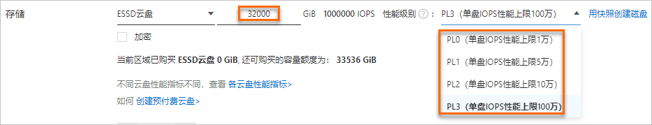

# 随机读写块存储容量-ESSD云盘-云服务器 ECS-阿里云

阿里云 ESSD（Enterprise SSD）云盘结合 25 GE 网络和 RDMA 技术，提供单盘高达 1,000,000 随机读写 IOPS 和高吞吐的低时延性能。本文介绍 ESSD 云盘的性能级别、适用场景及性能上限，并提供选择不同性能级别时的参考信息。

### ESSD 云盘概述

* API 取值：cloud\_essd
* 提供四个性能级别（PL0\~PL3），核心差异为单盘性能上限。

### ESSD 云盘的规格（概要）

| ESSD 云盘属性       |                                   PL3 |                                     PL2 |                                PL1 |                                PL0 |
| --------------- | ------------------------------------: | --------------------------------------: | ---------------------------------: | ---------------------------------: |
| 性能描述            |                      极高 I/O 性能，读写时延稳定 |                         高 I/O 性能，读写时延稳定 |                  中等 I/O 性能，读写时延较稳定 |                  中等 I/O 性能，读写时延较稳定 |
| 云盘容量范围（GiB）     |                       1,261 \~ 65,536 |                           461 \~ 65,536 |                       20 \~ 65,536 |                        1 \~ 65,536 |
| 数据可靠性           |                           99.9999999% |                             99.9999999% |                        99.9999999% |                        99.9999999% |
| 单盘最大 IOPS       |                             1,000,000 |                                 100,000 |                             50,000 |                             10,000 |
| 单盘最大吞吐量（MB/s）   |                                 4,000 |                                     750 |                                350 |                                180 |
| 单盘 IOPS 计算公式    |       min{1800 + 50 \* 容量, 1,000,000} |           min{1800 + 50 \* 容量, 100,000} |       min{1800 + 50 \* 容量, 50,000} |       min{1800 + 12 \* 容量, 10,000} |
| 单盘吞吐量计算公式（MB/s） |           min{120 + 0.5 \* 容量, 4,000} |               min{120 + 0.5 \* 容量, 750} |          min{120 + 0.5 \* 容量, 350} |         min{100 + 0.25 \* 容量, 180} |
| 业务场景示例          | 中大型核心业务关系型数据库及 NoSQL、大型 SAP/Oracle 系统 |            中等规模关系型/NoSQL、ELK 日志集群、企业级软件 | 中小型 MySQL/SQLServer、ELK、容器应用、企业级软件 | 中小型 MySQL/SQLServer、ELK、容器应用、企业级软件 |
| 推荐替换对象示例        |        在推荐业务场景下，系统盘或数据盘建议替换为 ESSD 云盘。 | 16 核 vCPU 以上本地 SSD 实例规格族（i1、i2、i2g）的数据盘 | SSD 云盘、本地 SSD 实例规格族（i1、i2、i2g）的数据盘 |                         SSD 云盘、系统盘 |

说明：关于如何压测 ESSD 云盘，请参见测试指南（链接保留在文末）。

### 计费

ECS 支持按量付费和包年包月的 ESSD 云盘。不同性能级别的定价详情，请参见块存储定价（链接见文末）。

### 适用场景

ESSD 适用于时延敏感或 I/O 密集型场景，例如：

* 大型 OLTP 数据库（MySQL、PostgreSQL、Oracle、SQL Server）
* NoSQL 数据库（MongoDB、HBase、Cassandra 等）
* Elasticsearch 分布式日志（ELK）与日志分析

### 支持 NVMe 协议

ESSD 支持以 NVMe 协议挂载到 ECS 实例，并支持云盘多重挂载（挂载到多个 ECS 实例）。详见相应文档（链接见文末）。

### 容量范围与性能级别的关系

不同容量能达到的性能不同：单位容量的 I/O 性能在各性能级别间一致，但总性能随容量线性增长，直到达到该性能级别的单盘性能上限。

| 性能级别 | ESSD 云盘容量范围（GiB） |   最大 IOPS | 最大吞吐量（MB/s） |
| ---- | ---------------: | --------: | ----------: |
| PL0  |      1 \~ 65,536 |    10,000 |         180 |
| PL1  |     20 \~ 65,536 |    50,000 |         350 |
| PL2  |    461 \~ 65,536 |   100,000 |         750 |
| PL3  |  1,261 \~ 65,536 | 1,000,000 |       4,000 |



### 示例：容量为 20 GiB

* 可选性能级别：PL0 或 PL1
* 对应 IOPS 上限分别为：10,000（PL0）和 50,000（PL1）




### 示例：容量为 32,000 GiB

* 可选性能级别：PL0, PL1, PL2, PL3
* 对应 IOPS 上限分别为：10,000（PL0）、50,000（PL1）、100,000（PL2）、1,000,000（PL3）




### 实例规格的存储 I/O 性能

部分新一代实例规格族的存储 I/O 性能与实例规格呈线性正相关（例如存储增强型实例规格族 g7se：规格越高，存储 IOPS 与吞吐越高）。更多信息请参见说明文档（链接见文末）。

实例规格与 ESSD 云盘性能关系要点：

* 若 ESSD 云盘的性能总和不超过实例规格族的存储 I/O 能力：实际存储性能以 ESSD 云盘性能为准。
* 若 ESSD 云盘的性能总和超过实例规格族的存储 I/O 能力：实际存储性能以实例规格的存储 I/O 能力为准。



### 示例 1

* 实例：ecs.g7se.xlarge（16 GiB），最大存储 I/O 性能：60,000 IOPS
* 挂载：1 块 2,000 GiB、PL2（单盘 IOPS 最大为 100,000）
* 结果：实例最大存储 IOPS 为 60,000（受实例能力限制），无法达到单盘 100,000



### 示例 2

* 实例：ecs.g7se.4xlarge（64 GiB），最大存储 I/O 性能：150,000 IOPS
* 挂载：3 块 2,000 GiB、PL2（单盘 IOPS 最大为 100,000；总 IOps 最大为 300,000）
* 结果：实例最大存储 IOPS 为 150,000（受实例能力限制）



### 示例 3

* 实例：ecs.g7se.4xlarge（64 GiB），最大存储 I/O 性能：150,000 IOPS
* 挂载：1 块 2,000 GiB、PL3（单盘 IOPS 最大为 101,800）
* 结果：实例最大存储 IOPS 为 101,800（低于实例上限 150,000，但受单盘上限限制）



### ESSD 支持的实例规格族

ESSD 云盘 PL0\~PL3 支持的实例规格族，请参见实例规格族文档（链接见文末）。

### 相关文档（原文链接，保留查询参数/锚点）

* 测试 ESSD 云盘 IOPS 性能（压测说明）：https://help.aliyun.com/zh/ecs/user-guide/test-the-iops-performance-of-an-essd#task-2363356
* NVMe 云盘概述：https://help.aliyun.com/zh/ecs/user-guide/nvme-disks
* 云盘多重挂载功能：https://help.aliyun.com/zh/ecs/user-guide/enable-multi-attach
* 存储 I/O 性能：https://help.aliyun.com/zh/ecs/user-guide/storage-i-or-o-performance
* 实例规格族：https://help.aliyun.com/zh/ecs/user-guide/overview-of-instance-families#concept-sx4-lxv-tdb
* 变更云盘类型：https://help.aliyun.com/zh/ecs/user-guide/change-the-category-of-a-disk
* 修改 ESSD 云盘性能级别：https://help.aliyun.com/zh/ecs/user-guide/modify-the-performance-levels-of-essds
* 块存储定价（定价详情页面）：https://www.aliyun.com/price/product#/disk/detail

### 附：相关页面

* 上一篇：ESSD PL-X 云盘（邀测）：https://help.aliyun.com/zh/ecs/user-guide/essd-pl-x-cloud-disk
* 下一篇：弹性临时盘：https://help.aliyun.com/zh/ecs/user-guide/elastic-ephemeral-disks

（图片与外部链接均保留原始 URL）
