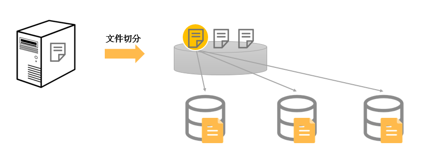
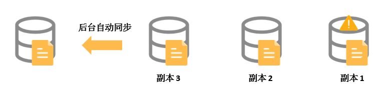

# 云盘三副本技术的原理与数据保护机制-云服务器 ECS-阿里云

阿里云云盘三副本技术通过分布式文件系统为云服务器 ECS 提供稳定、高效、可靠的数据随机访问能力，为 ECS 实例实现 99.9999999% 的数据可靠性保证。本文介绍三副本的概念及原理。

### 三副本介绍

阿里云提供了一个扁平的线性存储空间，在内部会对线性地址进行切片，一个分片称为一个 Chunk（中文含义为块）。每一个 Chunk，阿里云都会复制成三个副本，并将这些副本按照一定的策略存放在存储集群中的不同数据节点上，保证数据的可靠性。您对云盘的读写最终都会被映射为对阿里云数据存储平台上的文件的读写。

对云盘上的数据而言，所有用户层的读写操作都会同步到底层的三份副本上。这种三副本模式，能够保障您数据的可靠性和一致性。

### 三副本原理

在阿里云数据存储平台中，有三类角色，分别为 Master、Chunk Server 和 Client。您的一个写操作最终由 Client 执行，执行过程简要说明如下：



### 写操作：定位 Chunk

Client 收到写操作请求，并计算出写操作对应的 Chunk。



### 向 Master 查询副本位置

Client 向 Master 查询该 Chunk 的三份副本存放的数据节点（即 Chunk Server）。



### 向三台 Chunk Server 写入

Client 根据 Master 返回的结果，向这三个 Chunk Server 发出写请求。



### 写入成功判定

如果三份都写成功，Client 返回成功，反之则 Client 返回失败。



为防止由于一个 Chunk Server 或一个机架的故障导致数据不可用，Master 会保证三份副本分布在不同机架下的不同 Chunk Server 上。因此，Master 的分布策略中会综合考虑数据存储平台中所有 Chunk Server 的硬盘使用情况、交换机的分布情况、电源供电情况和节点负载情况等。

### 数据保护机制

当有数据节点损坏，或者某个数据节点上的部分硬盘发生故障时，集群中部分 Chunk 的有效副本数就会小于三。此时，Master 就会发起自动同步任务，在 Chunk Server 之间复制数据，使集群中所有 Chunk 的有效副本数达到三份。


如果 ECS 实例由于病毒感染、人为误删除或黑客入侵等软故障原因造成数据丢失，需要您采用备份或者快照等技术手段来解决。任何技术都不可能解决全部问题，因地制宜地选择合适的数据保护措施，才能为您的业务数据筑起一道坚实的防线。更多有关快照的详情，请参见 快照概述（链接）：https://help.aliyun.com/zh/ecs/user-guide/snapshot-overview#concept-qft-2zw-ydb

