# 在不同阿里云账号间过户ECS实例-云服务器 ECS-阿里云

企业架构发生变化、业务归属调整或者业务计划迁移，需要将ECS实例转移到另一个阿里云账号下。ECS资源过户是指用户将已购买的ECS实例及其相关资源的所有权从一个阿里云账户转移到另一个阿里云账户的过程。该功能用于在不同阿里云账户间进行ECS实例资源的无缝转移，确保业务连续性和管理灵活性。

### 过户资源范围

* 支持商品：包年包月的ECS实例和按量付费的ECS实例。
* 不支持：抢占式ECS实例过户。
* 过户只变更ECS实例所属用户信息；地域、可用区、规格、云盘（系统盘+数据盘）、固定公网IP配置保持一致。
* 实例的快照、自定义镜像不会被过户转移。

### 费用和耗时

* 过户大约需半小时。
* 过户不收取费用。过户成功后，后续ECS实例费用由目标账号支付。

### 过户影响（注意事项）

* 过户前需停止运行中的ECS服务器；过户过程中实例将处于停止状态。
* 过户会更换实例的VPC，网络位置和互通性会发生变化，无法与原VPC内的其他实例直接互通。如需跨账号跨VPC互通，请参见使用VPC对等连接实现VPC私网互通：https://help.aliyun.com/zh/vpc/create-and-manage-vpc-peering-connection ""。
* 私网IP可能会变更。如果私网IP被其他服务或应用使用，需要修改为过户后的私网IP；或在目标账号的VPC规划相同网段，过户完成后再修改私网IP为原地址以保持不变。
* 实例的固定公网IP地址不变。
* 安全组：过户后以目标安全组访问规则为准。若目标安全组没有相应规则，可导出原安全组规则并导入目标安全组，参考：导入导出安全组规则 https://help.aliyun.com/zh/ecs/user-guide/manage-security-group-rules#f3d78f19b0t3z ""。

### 限制条件

#### 对账号的要求

* 仅完成实名认证的阿里云主账号支持过户；RAM（子账号）不支持。
* 账号不能欠费（源账号与目标账号均需结清欠费）。
* 以下账号间过户支持性说明：

| 源账号         | 目标账号                                                                                 | 支持情况 |
| ----------- | ------------------------------------------------------------------------------------ | ---- |
| 个人账号 → 个人账号 | 同实名认证：支持。非同名或目标非实名认证用户：仅支持将ECS过户给单个个人账号，不支持继续过户给其他个人账号。若不满足：可考虑共享镜像或SMC方案（参见其他迁移方案）。 |      |
| 企业账号 → 企业账号 | 同实名认证且企业主体与名称一致：支持（一个企业主体最多可认证10个账号）。其他场景不支持；可考虑共享镜像或SMC方案。                          |      |
| 个人账号 → 企业账号 | 仅支持过户给一个企业账号，不支持继续过户给其他企业账号；可考虑共享镜像或SMC方案。                                           |      |
| 企业账号 → 个人账号 | 不支持；可考虑共享镜像或SMC方案。                                                                   |      |

* 源账号或目标账号为托管账号（被托管为主账号除外）、分销客户、虚商客户等非官网直客账号不支持过户。
* 源账号和目标账号不能跨站点（例如中国站与国际站）。
* 源账号和目标账号不能为同一账号。
* 目标账户需有可用余额；目标账户可用金余额不足100元时不支持过户。
* 源或目标账号处于注销流程或冻结状态不支持过户。
* 过户不支持托管账号中的被托管账号（子账号）发起过户。

#### 对实例的要求

过户不支持以下情况（包括但不限于）：

* 实例半年内已过户一次（以过户成功为准）。
* 部分营销活动中的实例或被判定为同一用户购买的实例（例如同证件、手机号、支付账号、设备、地址等关联）不支持过户。
* 过户过程中不允许修改实例地域和可用区。
* 抢占式实例不支持过户。
* 实例创建后5天内不支持过户。
* 包年包月实例到期前72小时内不支持过户。
* 使用云分期等受限付款方式且尚未付清分期款项的实例不支持过户（付清后可过户）。
* 实例存在预约变配（续费降配、临时带宽升级等）或生效中的临时升级配置不支持过户。
* 实例处于已过期、已锁定等异常状态不支持过户。
* 实例正在挂载或卸载磁盘时不支持过户；挂载了加密云盘的实例不支持过户（参见加密概述 https://help.aliyun.com/zh/ecs/user-guide/encryption-overview#concept-2383230 ""）。
* 实例运行在专有宿主机上不支持过户（参见什么是专有宿主机DDH https://help.aliyun.com/zh/dedicated-host/product-overview/what-is-ddh#concept-yqx-czm-tdb ""）。
* 使用镜像市场中的镜像的实例不支持过户（参见镜像市场 https://help.aliyun.com/zh/ecs/user-guide/alibaba-cloud-market-mirror-images#concept-spg-mct-xdb ""）。
* 实例绑定了HaVip（高可用虚拟IP）、反向访问服务、指定下一跳路由规则、SLB、全球加速等服务时不支持过户（相关说明见文档中的各功能页）。
* 实例有未支付订单、存在预约的物理机迁移升级任务时不支持过户，必须先取消或等待完成。
* 实例绑定了密钥对，须先解绑密钥对（解绑密钥对：https://help.aliyun.com/zh/ecs/user-guide/ssh-key-pairs/#c7447831d67ds ""）。
* ESSD AutoPL 云盘开启性能突发服务（ioburst service）的实例不支持过户。可由源账号关闭该性能突发或由目标账号购买并开启相应云盘后再过户（关闭方法见：关闭ESSD AutoPL性能突发 https://help.aliyun.com/zh/ecs/user-guide/modify-the-performance-configurations-of-an-essd-autopl-disk#section-bh2-kn8-5bm ""）。
* VPC 类型的ECS实例在过户前必须先停机；VPC 类型实例不支持随实例携带弹性公网IP（过户前需先解绑EIP，解绑操作见：https://help.aliyun.com/zh/eip/disassociate-an-eip-from-a-cloud-resource ""）。按量付费的弹性公网IP可以单独过户（过户按量付费EIP：https://help.aliyun.com/zh/eip/transfer-pay-as-you-go-eip ""）。
* VPC 类型的ECS实例不支持随实例过户附加的辅助网卡，须先解绑辅助网卡（解绑弹性网卡：https://help.aliyun.com/zh/ecs/user-guide/manage-eni#concept-ulq-w3k-zdb ""）。
* 实例涉及到其他云服务授权（例如DTS），须先取消云服务授权信息。
* 过户后的实例如果发起退款，只能退0元；若存在新订单，退款按新订单规则执行。
* 其他限制包括目标安全组实例配额不足、目标安全组与实例网络类型不一致、经典网络类型实例开启 Classic Link 未解除等情况（ClassicLink 文档：https://help.aliyun.com/zh/vpc/using-classiclink ""）。

### 操作流程

ECS 实例过户流程如下图示意（图片保留于原链接）：

#### 过户前准备（需准备的信息）

* 目标账号UID（如：1404423\*\*\*\*\*\*\*\*）。
* 目标账号名称。
* 需要过户的实例ID（例如：i-bp\*\*\*\*\*\*\*\*\*\*\*o6rvr）。
* 目标VPC、交换机和安全组（目标账号需提供过户后账号安全组ID和交换机ID，且二者与目标VPC同属同一可用区）。

示例格式：

* 过户后账号安全组ID：sg-bp1e\*\*\*\*\*\*\*\*\*\*\*b62q
* 过户后账号交换机ID：vsw-bp1\*\*\*\*\*\*\*\*\*\*\*\*soivp5

关于创建安全组与VPC请参见：

* 创建安全组：https://help.aliyun.com/zh/ecs/user-guide/create-a-security-group-1 ""
* 创建专有网络VPC：https://help.aliyun.com/zh/vpc/user-guide/create-and-manage-a-vpc ""

如果希望保持私网IP不变，可选择相同网段的交换机并在过户完成后手动将私网IP修改为原地址（修改私网IPv4地址：https://help.aliyun.com/zh/ecs/user-guide/modify-a-private-ip-address#bf60f728d0p4m ""）。

### 过户操作（步骤）



### 源账号发起过户操作

操作流程：

* 登录费用与成本控制台，选择 资源过户： https://billing-cost.console.aliyun.com/resource/transfer/overview
* 在 “可过户资源” 页签，选择要过户的ECS实例，点击 操作 列的 发起过户。
* 在 “过户” 页面，填写目标账号UID和目标账号名称，勾选同意《过户协议》，点击 提交。
* 在弹出的风控核身校验窗口完成校验，校验通过后点击 确认过户，进入过户生产环节，等待过户完成。
* 在 “我发起的资源过户” 页签可查看到新增条目，状态为 待确认，说明发起成功。

重要事项：

* 若目标账号在24小时内未确认，过户申请失效，需要重新发起。
* 目标账号确认前，源账号可随时取消过户。



### 目标账号确认过户操作

请及时联系目标账号完成确认：

* 目标账号登录费用与成本控制台，选择 资源过户（同上链接）。
* 进入 “我确认的资源过户” 页签。
* 点击待确认资源 操作 列的 查看详情，确认实例信息后，点击 确认接收过户。
* 在 “接收资源过户的配置” 页面，选择 过户后账号安全组ID 和 过户后账号交换机ID，勾选同意《过户协议》，点击 确认接收。
* 完成后，“我确认的资源过户” 页签会显示状态为 过户完成。
* 启动ECS实例：登录ECS管理控制台实例页面，选择实例所在地域，点击 启动，使实例进入 运行中。

说明：

* 过户后账号安全组ID与交换机ID需由目标账号提供，且与过户实例处于同一可用区和同一VPC。
* 如不希望私网IP变更，可选择相同网段的交换机并在过户后修改私网IP（修改私网IPv4地址链接见上）。



### 源账号确认过户完成

* 源账号登录费用与成本控制台，选择 资源过户。
* 进入 “我发起的资源过户” 页签，确认过户状态。
* 当状态为 过户完成 时，说明整个过户流程完成，目标账号即可使用该实例。



### 过户后确认（会发生的变更）

* 实例将从源账号控制台移除，加入目标账号控制台。
* 实例从源账号的安全组移除并添加到目标账号的安全组。
* 源账号会新增一个0元退款订单，目标账号会新增一个0元新购订单。
* 包年包月实例的到期时间保持不变。
* 随实例创建的系统盘、数据盘已过户到目标账号（手动挂载的云盘也会过户）。
* 实例上系统分配的固定公网IP已过户到目标账号。
* 私网IP会由目标交换机根据CIDR重新分配；如需保持私网IP不变，可在过户后手动修改私网IP（见修改私网IPv4地址链接）。

### 常见问题（FAQ）

1. 为什么我确认过户时发现过户单已经失效了？

答：从过户单流转到目标账号后，目标账号需在24小时内处理完；超过24小时则过户单会失效。

2. 实例过户有哪些业务限制？

答：

* 过户前：过户前需要完成的准备工作很多，过户过程会进行多项规则校验，如实例不符合规则，过户时会提示。
* 过户中：实例在过户中时，不允许进行升降配、手动续费、注销、退订、更换操作系统、带宽升降级、预付/后付互转等操作；允许自动续费（费用由归属账号扣除）。
* 过户后：退订和降配的退款金额为0元；如已续费再退订，可退还续费部分的剩余价值；如已升配再降配，可退还升配部分的剩余价值。

### 其他迁移方案

当ECS资源过户方案无法满足迁移需求时，可考虑以下两种间接迁移方案：

#### 方案 1：共享自定义镜像

基本思路：在源服务器创建自定义镜像并共享至目标账号，目标账号使用共享镜像创建新ECS实例。

步骤：

* 在源账号使用实例创建自定义镜像： https://help.aliyun.com/zh/ecs/user-guide/create-a-custom-image-from-an-instance ""
* 共享自定义镜像到目标账号： https://help.aliyun.com/zh/ecs/user-guide/share-a-custom-image/ ""
* 目标账号使用共享镜像创建ECS实例： https://help.aliyun.com/zh/ecs/user-guide/use-shared-images#section-j1m-4xu-hst ""

#### 方案 2：通过云服务器迁移中心 SMC

使用阿里云服务器迁移中心(SMC)实现跨账号或同账号的ECS实例迁移。参考：跨账号和同账号ECS实例间迁移 https://help.aliyun.com/zh/smc/user-guide/migrate-servers-between-ecs-instances ""

### 参考链接

* 过户风险提示（请在过户前认真阅读）：https://terms.aliyun.com/legal-agreement/terms/suit\_bu1\_ali\_cloud/suit\_bu1\_ali\_cloud202105211127\_39049.html
* 资源过户控制台入口： https://billing-cost.console.aliyun.com/resource/transfer/overview

如果需要，我可以帮你提取要过户的实例信息检查是否满足常见限制，或把“过户前准备”项整理为可复制的清单供操作时填写。
