# 无法远程连接Windows实例的处理方法-阿里云帮助中心

无法远程连接 Windows 实例的原因较多。请根据实际情况逐步排查。本文首先介绍使用自助诊断工具的方式，然后给出手动排查的分步方法与常见场景的处理方法。

***

## 使用自助问题排查工具

阿里云自助问题排查工具可快速检测安全组配置、实例内防火墙及常见端口监听状态，并给出诊断报告。

单击 一键诊断 进入自助问题排查页面，并切换至目标地域。\
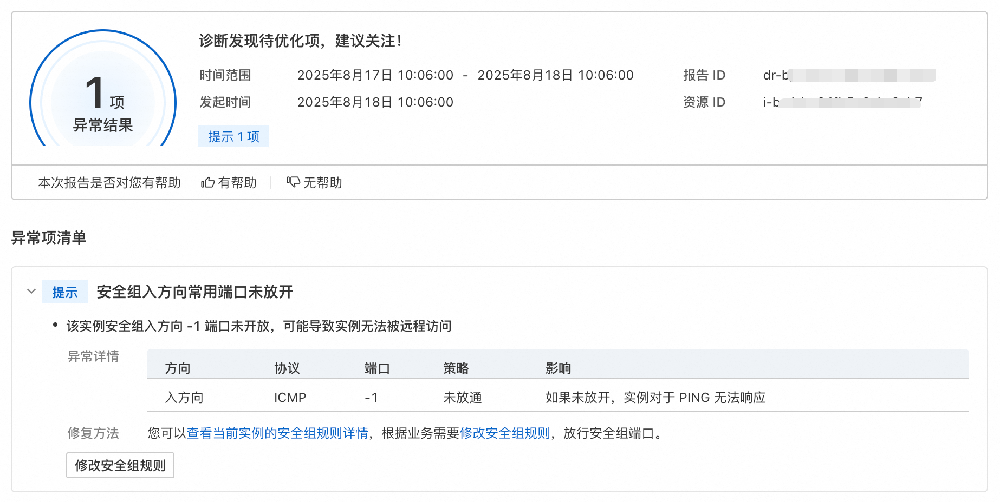

如果自助问题排查工具未能定位问题，请继续手动排查。

***

## 手动排查

下面为手动排查的主要流程（先检查实例状态，然后根据需要通过 VNC 或云助手操作实例）。将常规顺序整理为步骤，便于按顺序执行。



### 检查 ECS 实例状态

无论何种原因导致无法远程登录，请先确认实例状态为“运行中”，否则无法提供远程访问。

* 访问 ECS 控制台-实例： https://ecs.console.aliyun.com/server/region
* 在页面左侧顶部选择目标资源所在的资源组和地域。\
  
* 在“实例”页面单击目标实例 ID，查看“实例详情”页签下的基本信息，确认“实例状态”与“健康状态”，并选择合适的远程登录方式。

参考的实例生命周期与推荐登录方式（示例）：

* 启动中 / 运行中（Initializing）→ VNC
* 正常/操作系统运行存在异常（Impaired）→ VNC 和 WorkBench
* 已关机（Stopped）→ 无法登录

更多实例生命周期信息： https://help.aliyun.com/zh/ecs/user-guide/instance-lifecycle



### 通过 VNC 登录 ECS 实例

当云助手不可用或不足以诊断问题时，可使用阿里云 VNC 工具远程登录控制台：

1. 访问 ECS 控制台-实例（https://ecs.console.aliyun.com/server/region），选择资源组和地域。
2. 在“实例”页面找到目标实例，单击“远程连接”（操作列）。
3. 在“远程连接”对话框中，选择“展开其他登录方式”→ “通过VNC远程连接”→ 点击“立即登录”。
4. 登录实例操作系统后，可执行下列操作：
   * 在页面左上角：单击发送远程命令 > CTRL+ALT+DELETE（发送 Ctrl+Alt+Del）。\
     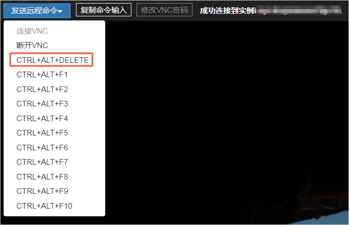
   * 输入实例登录密码后按 Enter（Windows 实例默认管理员账户为 Administrator）。



### 通过云助手向 Windows 实例发送命令

使用云助手可在未登录实例的情况下发送命令执行诊断或修复操作：

1. 访问 ECS 控制台-实例（https://ecs.console.aliyun.com/server/region），选择资源组和地域。
2. 在“实例”页面找到目标实例，在“操作”下选择 “远程连接 → 发送命令”。
3. 输入需要执行的命令，点击“立即执行”。

云助手概述： https://help.aliyun.com/zh/ecs/user-guide/overview-10\
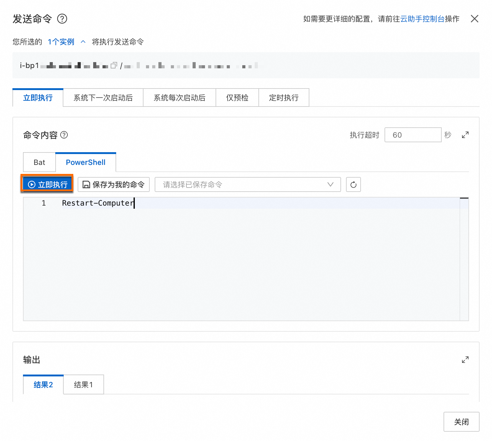



***

## 没有明确的报错信息 — 逐项排查

当远程连接失败且没有系统返回明确报错信息（实例为运行中），请按以下步骤逐项排查。此处将这 12 个具体排查项以 stepper 展示，便于逐一执行。



#### 使用阿里云 Workbench 工具测试远程登录

* 访问 ECS 控制台-实例（https://ecs.console.aliyun.com/server/region），选择资源组与地域。
* 在实例操作中选择“远程连接”→“通过Workbench远程连接”→ 点击“立即登录”。
* Workbench 会自动填充必要信息，输入用户名与认证信息后尝试登录。
  * 若 Workbench 返回错误与解决方案，请按提示处理并重试。
  * 若 Workbench 能登录但本地无法登录，表明端口与服务正常，可在本地端做进一步排查。
* 若 Workbench 异常，可尝试通过 VNC 远程连接来解决 Workbench 常见问题。\
  参考：VNC 远程连接问题 https://help.aliyun.com/zh/ecs/through-vnc-instance-remote-connection-problems#f799836096lr6



#### 检查是否收到“黑洞”通知（DDoS 黑洞）

* 黑洞期间无法支持公网访问服务器。检查是否收到了阿里云黑洞通知。
* 参考阿里云黑洞策略： https://help.aliyun.com/zh/anti-ddos/product-overview/blackhole-filtering-policy-of-alibaba-cloud



#### 检查端口及安全组

1. 控制台路径：ECS 控制台-实例 → 选择实例 → 安全组 页签 → 管理规则。
2. 检查入站规则是否允许 RDP（默认 TCP 3389）：
   * 快速添加规则：选择“RDP 远程连接 Windows 实例”。
   * 手动添加规则示例：
     * 授权策略：允许
     * 优先级：1（越小优先级越高）
     * 协议：自定义 TCP
     * 访问来源 IPv4：0.0.0.0/0（或按需限制来源）
     * 访问目的端口：3389（或自定义 RDP 端口）
3. 通过 IP:端口 测试端口连通性，例如：

```javascript
telnet <IP> <Port>
```

* 正常示例输出： Trying 192.168.0.1 ... Connected to 192.168.0.1 4389. Escape character is '^]'
* 若端口测试失败，请参见：使用 ping 正常但端口不通时的端口可用性探测 https://help.aliyun.com/zh/ecs/troubleshooting-for-ping-attempts-to-pass-the-server-and-port-disconnection



#### 检查防火墙配置（Windows 防火墙）

> 仅在有权限/允许修改防火墙的前提下进行。

1. 通过 VNC 登录实例。
2. 开始 → 控制面板 → Windows 防火墙（查看方式选择小图标）。\
   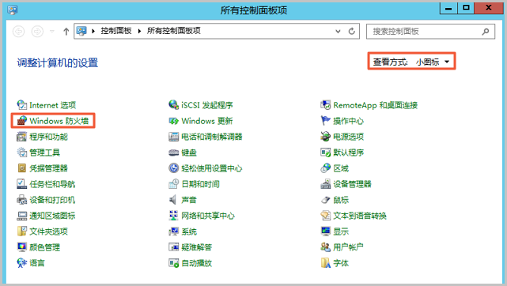
3. 单击“高级设置”，确保防火墙启用并在“入站规则”中启用远程桌面相关规则（如“远程桌面-用户模式（TCP-In）”）。
   * 在“高级安全 Windows 防火墙” → Windows防火墙属性，建议将域/专用/公用配置均启用。
   * 启用远程桌面入站规则：右键“远程桌面-用户模式（TCP-In）”→ 启动规则(E)。\
     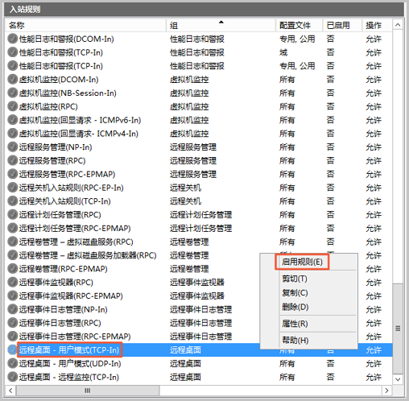

* 管理 Windows 防火墙参见： https://help.aliyun.com/zh/ecs/user-guide/manage-windows-system-firewall



#### 检查远程桌面服务 (Remote Desktop Services)

1. 通过 VNC 登录实例。
2. 在系统界面选择“远程设置”，确保已选中“允许远程连接到此计算机”。\
   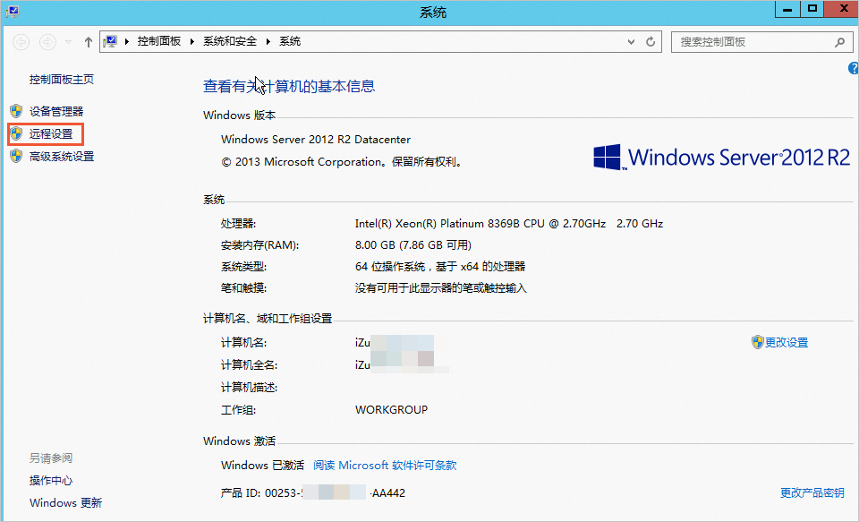
3. 在“服务（本地）”中找到并启动 Remote Desktop Services（Remote Desktop 服务）。\
   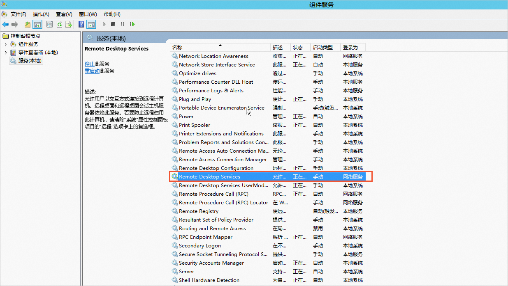
4. 检查远程桌面依赖服务是否被禁用：
   * 运行 msconfig → 常规 → 选择“正常启动”，然后重启实例。\
     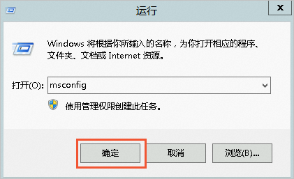
   * 如需重启实例参见：重启 ECS 实例 https://help.aliyun.com/zh/ecs/user-guide/restart-instances



#### 检查远程终端服务配置（RDP TLS、自签名证书等）

可能导致问题的常见异常：

* 异常一：服务器侧自签名证书损坏\
  解决示例（以 Windows Server 2008/2012 为例）：
  1. 通过 VNC 登录 → 管理工具 → 远程桌面服务 → 远程桌面会话主机配置。\
     
  2. 在“RDP-Tcp”属性中，将“安全层”修改为“RDP 安全层”，确认并在“操作”中先禁用连接再启用连接。\
     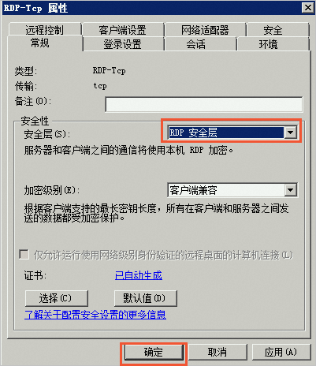
* 异常二：RDP-Tcp 连接被禁用
  * 使用 VNC 登录并重新启用 RDP-Tcp（参见上文）。
* 异常三：终端服务器角色配置（授权问题）
  * 如果出现“没有远程桌面授权服务器可以提供许可证”或“远程桌面用户组没有该权限”等报错，请参阅相关文档或移除/调整终端服务器角色配置。\
    参考文档链接：
  * 许可证错误与授权配置（多篇链接见下方“存在明确报错信息”或文末相关文档）。



#### 检查网络（网卡、连通性、抓包）

1. 在不同网络环境（不同网段或运营商）下从本地尝试连接，判断是否为本地网络或运营商问题。
2. 排查网卡或网卡驱动异常（示例以 Windows Server 2016）：
   * 通过 VNC 登录 → 打开网络和共享中心 → 更改适配器设置，确认网卡已启用。\
     
   * 在注册表中确认 NetCfgx.dll 安装器项（路径：HKEY\_LOCAL\_MACHINE\SYSTEM\CurrentControlSet\Control\Class{4d36e972-e325-11ce-bfc1-08002be10318}），如无则新建 Installer32，值为 NetCfgx.dll,NetClassInstaller（修改注册表后需重启生效）。
   * 设备管理器 → 网络适配器 → 更新驱动程序。
3. 在本地客户端使用 ping 测试与实例连通性；若存在丢包或链路问题，使用抓包或 MTR 工具进一步分析：
   * 抓包说明： https://help.aliyun.com/zh/ecs/user-guide/how-to-grab-data-packets-when-the-network-is-abnormal
   * 使用 MTR 进行链路分析： https://help.aliyun.com/zh/ecs/user-guide/use-mtr-tool-for-network-analysis



#### 检查 CPU 负载、带宽与内存使用情况

1. CPU：
   * 若 CPU 使用率过高，可能导致服务无响应。检查是否为 Windows Update 或应用程序引起，必要时等待或扩容实例规格。
   * 参考：Windows ECS CPU 使用率高的排查与解决。
2. 公网带宽：
   * 在实例详情中查看公网带宽配置；若带宽为 0 Mbps，说明实例没有公网带宽，需升级公网带宽： https://help.aliyun.com/zh/ecs/user-guide/overview-of-instance-configuration-changes#ChangeBandwidth
3. 内存：
   * 若连接后桌面无法正常显示并直接退出，可能是内存不足。通过 VNC 登录 → 事件查看器，检查内存不足相关日志并按需扩容或释放资源。
   * 参考：Windows 实例虚拟内存不足处理 https://help.aliyun.com/zh/ecs/support/troubleshooting-windows-low-virtual-memory-problem



#### 检查系统安全策略设置

1. 通过 VNC 登录 → 控制面板 → 管理工具 → 本地安全策略。\
   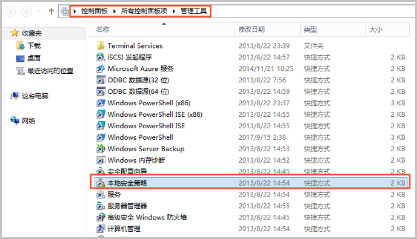
2. 在“IP 安全策略，本地计算机”中，查看是否存在阻断远程桌面的策略：
   * 若存在，删除或重新编辑该策略以允许远程桌面连接（右键删除或双击编辑）。\
     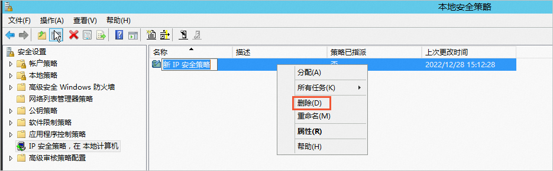
3. 若不存在相关策略，继续按照其它步骤排查。



#### 检查杀毒软件与第三方安全软件

第三方安全/防护软件（例如安全狗）可能拦截或禁用远程访问：

* 如果安装了杀毒/安全软件，尝试通过 VNC 登录后升级或卸载该软件并重启实例。
* 示例案列：
  * 安全狗黑名单拦截：检查“超级黑名单”中是否包含 ECS 实例公网 IP，若有则删除黑名单并将 IP 加入白名单。\
    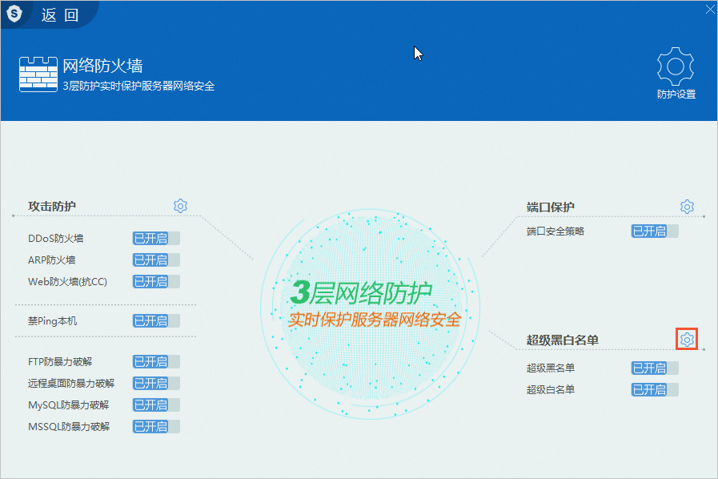
  * 安全狗程序异常：若弹出网络驱动异常提示，可卸载安全狗并重启恢复网络。
* 推荐使用商业版杀毒软件或 Microsoft Safety Scanner（https://www.microsoft.com/security/scanner/zh-cn/default.aspx）在安全模式下扫描。



#### Windows 注册表配置异常修复

1. 通过 VNC 登录 → 运行 regedit 打开注册表编辑器。\
   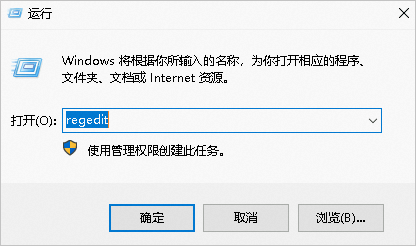
2. 修改以下键值：
   * 在 HKEY\_LOCAL\_MACHINE\SYSTEM\CurrentControlSet\Control\Terminal Server\WinStations\RDP-Tcp 中，将 fEnableWinStation 设置为 1。 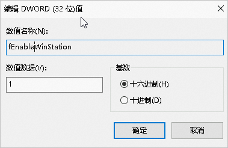
   * 在 HKEY\_LOCAL\_MACHINE\SYSTEM\CurrentControlSet\Control\Terminal Server 中，将 fDenyTSConnections 设置为 0。 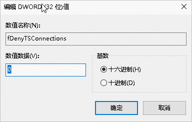
3. 修改后重启或根据需要重启服务使配置生效。



#### Windows RDP 自签证书到期

RDP 自签证书过期可能导致连接失败。通过 PowerShell 检查并重置证书：

1. 通过 VNC 登录并以管理员身份运行 PowerShell。
2. 查看当前自签证书的过期时间：

```powershell
Get-Item 'Cert:\LocalMachine\Remote Desktop\*' | Select-Object NotAfter
```

3. 若证书已过期，删除自签证书并重启 TermService 服务：

```powershell
Remove-Item -Path 'Cert:\LocalMachine\Remote Desktop\*' -Force -ErrorAction SilentlyContinue
Restart-Service TermService -Force
```

系统会自动生成新的自签证书。再次检查新证书过期时间：

```powershell
Get-Item 'Cert:\LocalMachine\Remote Desktop\*' | Select-Object NotAfter
```

说明：默认证书有效期约为半年。



***

## 存在明确报错信息

如果在远程连接时收到明确报错信息，请参考以下专题文档（将按错误类型分类）：

<details>

<summary>协议/连接错误</summary>

* 远程连接 Windows 系统 ECS 实例时提示“Because of a protocol error, this session will be disconnected”：\
  https://help.aliyun.com/zh/ecs/because-of-a-protocol-error-this-session-will-be-disconnected-please-try-connecting-to-the-remote-computer-again

</details>

<details>

<summary>授权与凭据相关错误</summary>

* 启用“密码保护共享”导致“凭据无法工作”错误：\
  https://help.aliyun.com/zh/ecs/what-do-i-do-if-the-error-message-your-credentials-don-t-work-appears-when-i-remotely-log-on-to-a-windows-instance
* 连接被拒绝：用户账户未被授权远程登录：\
  https://help.aliyun.com/zh/ecs/the-connection-was-denied-because-the-user-account-is-not-authorized-for-remote-login
* 未指定远程桌面授权服务器：\
  https://help.aliyun.com/zh/ecs/what-do-i-do-if-the-error-message-no-remote-desktop-license-server-is-specified-appears-when-i-connect-to-a-windows-server-2008-r2-instance-by-using-remote-desktop
* 远程桌面用户组无权限错误：\
  https://help.aliyun.com/zh/ecs/what-do-i-do-if-the-error-message-that-indicates-lack-of-terminal-server-user-access-permissions-appears-when-i-connect-to-a-windows-instance-by-using-remote-desktop

</details>

<details>

<summary>连接数/会话限制相关</summary>

* 终端服务器超出最大允许连接数：\
  https://help.aliyun.com/zh/ecs/resolve-the-terminal-server-has-exceeded-the-maximum-number-of-allowed-connections-error-on-a-windows-instance

</details>

***

## 相关文档

* 无法连接 Linux 实例的排查方法： https://help.aliyun.com/zh/ecs/troubleshooting-guidelines-when-you-cannot-remotely-log-on-to-a-linux-instance-through-ssh
* 通过 VNC 远程连接实例的问题： https://help.aliyun.com/zh/ecs/through-vnc-instance-remote-connection-problems
* SSH 远程连接问题： https://help.aliyun.com/zh/ecs/ssh-remote-connection-problems/
* 远程桌面（RDP）连接问题： https://help.aliyun.com/zh/ecs/remote-desktop-connection-issue/

***

如果按照上述步骤仍无法解决问题，请提供：

* 实例 ID（ECS 控制台中目标实例 ID）
* 实例当前“实例状态”“健康状态”
* 是否能通过 VNC 或 Workbench 登录以及对应错误信息（如有）
* 本地客户端的错误提示（若有）

我可以协助帮你进一步梳理下一步操作或定位要查看的日志/命令输出。
