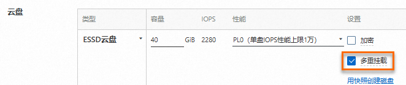

# 云盘多重挂载功能使用指南-云服务器 ECS-阿里云

当需要多台ECS实例并发读写访问同一块云盘，实现高效数据共享、快速故障转移时，您可以通过多重挂载功能将单个ESSD、ESSD AutoPL等类型云盘挂载至同一可用区内支持NVMe协议的多台ECS实例。本文介绍如何通过多重挂载功能将单块云盘挂载至多台ECS实例。

关于NVMe协议的更多说明，请参见 NVMe协议概述（https://help.aliyun.com/zh/ecs/user-guide/nvme-protocol ""）。

### 应用场景

云盘多重挂载主要有以下应用场景：

*   数据共享

    NVMe最简单的应用场景为数据共享，当数据被写入云盘后，其他节点均可以访问该数据，从而有效节省成本并提升读写性能。例如，在云上容器镜像场景，同一套系统的镜像通常相似，因此多个不同实例可以读取加载同一份镜像。

    
*   高可用故障转移

    业务高可用是共享盘最常见的应用场景之一。传统基于SAN的数据库，例如Oracle RAC、SAP HANA以及云原生高可用数据库等场景中，实际业务使用过程中可能存在单点故障，确保故障情况下业务连续性是高可用系统的核心能力。在云上，存储和网络具备极高的可用性，计算节点则可能受断电、宕机、硬件故障等影响，主备切换是常用的高可用解决方案。

    例如数据库场景，当主库故障时迅速切换到备库对外提供服务，实例切换后，可以通过NVMe PR命令释放旧实例的写入权限，从而确保旧实例不再写入数据确保数据一致性。故障转移流程说明如下：

    1. 数据库主实例1故障，导致业务停止。
    2. 下发NVMe PR命令，禁止数据库实例1继续写入数据，允许数据库实例2写入数据。
    3. 数据库实例2通过日志回放等方式恢复到和数据库实例1一致的状态。
    4. 切换数据库实例2为主实例，继续对外提供服务。

    说明：PR（Persistent Reservation）属于NVMe协议的一部分，PR可精确地控制某个云盘的读写权限，从而确保计算端按照预期写入数据。更多信息，请参见 NVMe PR协议（https://nvmexpress.org/wp-content/uploads/NVM-Express-1\_3c-2018.05.24-Ratified.pdf）。

    
*   分布式缓存加速

    开启多重挂载功能的云盘具备较高的IOPS和吞吐性能，可以为其他中低速的存储系统提供性能加速能力。例如数据湖场景，数据湖通常基于OSS搭建，可同时被多个客户端访问，但其随机读写性能较差。通过在计算节点上挂载高速云盘作为缓存，可以极大地提升访问性能。

    
*   机器学习

    在分布式机器学习训练中，将样本标注写入后，会将数据集分割成小块分发到多个计算节点上并行处理。云盘多重挂载使得每个计算节点都能直接访问共享的存储资源，无需通过网络频繁传输数据，减少数据传输延迟，从而加速模型训练过程。

    

### 计费说明

多重挂载功能本身不收费，使用多重挂载功能过程中涉及云盘、ECS实例等相关资源会产生费用。关于ECS资源计费的更多信息，请参见 计费概述（https://help.aliyun.com/zh/ecs/billing-overview#concept-isb-scd-5db ""）。

### 使用限制

使用多重挂载功能存在如下限制条件：

| 资源     | 限制说明                                                                                                                                                                                                                                                                                                                                                                                                                                                                                                                                                                        |
| ------ | --------------------------------------------------------------------------------------------------------------------------------------------------------------------------------------------------------------------------------------------------------------------------------------------------------------------------------------------------------------------------------------------------------------------------------------------------------------------------------------------------------------------------------------------------------------------------- |
| 云盘     | 
- 仅支持在单独创建云盘时开启多重挂载功能，不支持对存量云盘开启或关闭多重挂载功能。 - 仅数据盘支持开启多重挂载，系统盘不支持开启多重挂载。 - 仅支持按量付费的 ESSD云盘（https://help.aliyun.com/zh/ecs/user-guide/essds ""）、ESSD AutoPL云盘（https://help.aliyun.com/zh/ecs/user-guide/essd-autopl-disks ""）和 ESSD同城冗余云盘（https://help.aliyun.com/zh/ecs/user-guide/regional-essd-disks ""）。 - 当您将单块云盘同时挂载到多台ECS实例时，所有ECS实例的性能总和不能超过该云盘的性能上限。 - 开启多重挂载功能的云盘还不支持以下操作：随实例释放、控制台分区（说明：您只能登录实例内部分区格式化并挂载文件系统，具体操作请参见 初始化数据盘 https://help.aliyun.com/zh/ecs/user-guide/initialize-a-data-disk/ ""）、转换云盘计费方式、重新初始化云盘、变更云盘类型、修改ESSD云盘性能级别、快照一致性组。
 |
| 地域及可用区 | 与对应支持的实例规格族的售卖地域及可用区相同。                                                                                                                                                                                                                                                                                                                                                                                                                                                                                                                                                     |
| ECS实例  | 
- 实例规格族需要默认支持NVMe协议。更多信息请参见 实例规格族（https://help.aliyun.com/zh/ecs/user-guide/overview-of-instance-families#concept-sx4-lxv-tdb ""）。说明：您可以通过 DescribeInstanceTypes（https://help.aliyun.com/zh/ecs/api-describeinstancetypes#doc-api-Ecs-DescribeInstanceTypes ""）接口查询实例规格族，再根据查询结果中的 NvmeSupport 参数确认实例规格族是否支持NVMe。 - 开启多重挂载功能的单块云盘最多挂载至16台实例上。
                                                                                                                                                                                                                     |
| 镜像     | 镜像需要包含NVMe驱动。说明：您可以通过 API 接口 DescribeImages（https://help.aliyun.com/zh/ecs/developer-reference/api-ecs-2014-05-26-describeimages ""）中的 `NvmeSupport` 参数确认镜像是否支持NVMe。若自定义镜像没有安装NVMe驱动，可参考 如何为已有自定义镜像安装NVMe驱动？（https://help.aliyun.com/zh/ecs/adapt-linux-custom-images-to-nvme-based-system-disks ""）安装。                                                                                                                                                                                                                                                                     |

### 操作步骤



### 创建云盘时开启多重挂载功能

1. 访问 ECS 控制台 - 云盘（https://ecs.console.aliyun.com/disk/）。
2. 在页面左侧顶部，选择目标资源所在的资源组和地域。\
   
3. 单击 创建云盘。
4. 在创建云盘页面中，配置云盘参数并选中“多重挂载”。\
   

说明：本步骤仅描述创建云盘时如何为云盘开启多重挂载功能，更多参数说明请参见 创建空数据盘（https://help.aliyun.com/zh/ecs/user-guide/create-a-disk/#concept-jx1-tx1-ydb ""）。

主要参数说明：

* 是否挂载：选择“暂不挂载”，只创建云盘，不挂载到ECS实例。
* 地域及可用区：选择支持多重挂载功能的地域和可用区。
* 云盘付费方式：选择按量付费。
* 云盘：设置云盘存储信息并开启多重挂载功能（选择云盘类型，设置云盘容量等，勾选 多重挂载）。

创建成功后，在云盘列表页面查看新建云盘的“多重挂载”列已标识为“支持”。



### 将开启多重挂载功能的云盘挂载至多台ECS实例

1. 访问 ECS 控制台 - 实例（https://ecs.console.aliyun.com/server/region），在实例列表中获取支持NVMe协议的ECS实例ID。
2. 访问 ECS 控制台 - 云盘（https://ecs.console.aliyun.com/disk/）。
3. 找到目标云盘，在“操作”列中单击 挂载。
4. 在“挂载云盘”对话框中，设置挂载相关参数：
   * 目标实例：输入已获取的ECS实例ID。
   * 云盘随实例释放：不支持随实例释放（不选中此选项，当实例被释放时该云盘会被保留）。
5. 登录ECS实例，对云盘分区、格式化并挂载文件系统（具体操作请参见 初始化数据盘 https://help.aliyun.com/zh/ecs/user-guide/initialize-a-data-disk/ ""）。

重要提醒：开启多重挂载功能的云盘并挂载至多台ECS实例后，如果使用 ext3、ext4、xfs、ntfs 等单节点文件系统，多实例间数据无法同步，会导致数据不一致等问题。建议您自行创建适用于业务的集群文件系统，以确保写入的数据、创建的文件、修改的元数据能够实时同步到所有挂载节点。常用的集群文件系统包括 OCFS2、GFS2、Veritas CFS、Oracle ACFS 和 DBFS 等。具体操作请参见 基于NVMe共享盘部署集群文件系统（https://help.aliyun.com/zh/ecs/user-guide/deploy-a-cluster-file-system-based-on-nvme-disks ""）。

6. （可选）根据需要重复挂载操作，将云盘挂载至其他多台支持NVMe协议的ECS实例。

成功挂载后，您可以在云盘页面查看云盘状态变更为“使用中”，并将鼠标悬浮至“挂载实例”列的实例ID或实例名称处，查看云盘在一台或多台ECS实例的挂载信息。



### 相关文档

* 修改镜像的属性和标签（https://help.aliyun.com/zh/ecs/user-guide/modify-the-attributes-of-a-custom-image#section-6tk-p42-yxy ""）——可修改自定义镜像的NVMe驱动属性。
* 扩容云盘容量后多重挂载可能不生效的问题（步骤一：扩容云盘容量 https://help.aliyun.com/zh/ecs/user-guide/step-1-resize-a-disk-to-extend-its-capacity#section-1g0-m46-l2a ""）。
* 创建空数据盘（https://help.aliyun.com/zh/ecs/user-guide/create-a-disk/#concept-jx1-tx1-ydb ""）。
* 初始化数据盘（https://help.aliyun.com/zh/ecs/user-guide/initialize-a-data-disk/ ""）。
* 挂载数据盘（https://help.aliyun.com/zh/ecs/user-guide/attach-a-data-disk ""）。
* NVMe PR 协议（https://nvmexpress.org/wp-content/uploads/NVM-Express-1\_3c-2018.05.24-Ratified.pdf）。

（文档结束）
